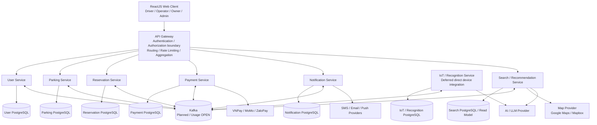
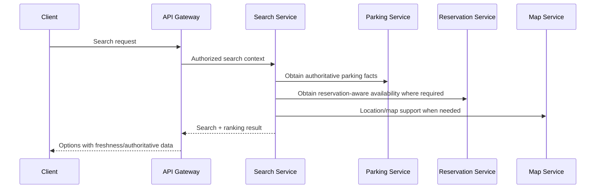

# SmartPark — Solution Architecture

**Project:** SmartPark

**Document:** Solution Architecture

**Architecture Baseline:** v0.9

**SRS Baseline:** `smartpark-srs-v0.9.md`

**Status:** Working Architecture Baseline / Review Candidate

**Revision Note (v0.9):** Updated against `smartpark-srs-v0.9.md`; confirmed v0.9 behaviors are reflected at architecture level, while `ARCH-DEF-01–09` remain unresolved unless already closed by prior decision.

**Language:** English

**Purpose:** Translate the v0.9 SRS into an implementable solution architecture while preserving the SRS as the authoritative requirements baseline.

---

## 0. Architecture Document Governance

### 0.1 Source of Truth

The **SmartPark SRS v0.9** is the authoritative source for functional behavior, business rules, non-functional requirements, scope, and confirmed C-01–C-23 decisions, including the BA-confirmed v0.9 review changes recorded in the SRS Appendix E.2.1.

This Solution Architecture document defines how those requirements are intended to be realized technically. It does **not** silently resolve SRS items marked `A`, `X`, `F`, `OPEN`, or `DEFERRED`.

Where this document introduces an architecture recommendation that is not explicitly confirmed by the SRS, it is marked **`SA-PROPOSED`** and must be reviewed before being treated as a final architecture decision.

### 0.2 Status Vocabulary

| Status | Meaning |
|---|---|
| **BASELINE** | Directly supported by the v0.9 SRS and usable as an architecture constraint. |
| **WORKING** | Current architecture direction intended for implementation planning, but still subject to architecture review. |
| **SA-PROPOSED** | Solution Architect recommendation introduced by this document. Not a new business requirement. |
| **OPEN** | Architecture choice remains unresolved in the SRS. |
| **DEFERRED** | Explicitly outside the current implementation or deferred for later resolution. |
| **CONFLICT** | Current source material contains incompatible statements that require explicit reconciliation. |

### 0.3 Architecture Principles


1. **SRS-first:** business behavior comes from the v0.9 SRS.
2. **Business rules stay in backend/domain logic:** UI, 3D visualization, and AI do not become authoritative business-rule engines.
3. **Service data sovereignty:** each microservice owns its persistence boundary.
4. **No cross-service database access:** services communicate through APIs or integration events.
5. **Synchronous when an immediate result is required; asynchronous when loose coupling/background processing provides a clear benefit.**
6. **Do not force Kafka into every workflow.**
7. **External providers are behind application-defined contracts/adapters.**
8. **Unknown financial outcomes are reconciled, not blindly retried.**
9. **Physical occupancy, reservation entitlement, allocation, protection, backup capacity, and payment are separate concepts.**
10. **Deferred features remain deferred:** real IoT, full offline mode, mobile application, personalized/model-based recommendations, forecasting, and anomaly detection are not silently promoted into MVP.

### 0.4 v0.9 Architecture Update Scope

This revision aligns the architecture with the BA-confirmed v0.9 SRS changes without redesigning the existing microservice direction. The update makes the following behavior explicit at architecture level:

- current authorization is re-checked for every protected operation; logout is distinct from permission revocation;
- registered plated vehicles remain distinct from Operator-managed parking sessions for supported non-plated vehicle categories;
- raw plate input and canonical normalized plate values are both retained;
- capacity reduction preserves accepted entitlements where possible, reallocates affected future reservations by established priority, and never displaces occupied vehicles automatically;
- allocation uses the confirmed two-stage deterministic ranking model;
- pricing uses actual local timestamps and interval overlap, with one final monetary rounding step;
- payment clearance is separated from actual departure and physical occupation release;
- refund handling has explicit approval/submission/completion states;
- UNKNOWN physical state is excluded from automatic allocation and automated violation decisions until authoritative resolution;
- notification delivery metadata and AI conversation retention/holds follow the v0.9 baseline; and
- deterministic fixtures remain the MVP simulation mechanism while a product simulator remains future/deferred and isolated from operational resources.

These updates do **not** close `ARCH-DEF-01–09` unless an existing decision already says so. New technical ownership choices introduced here are marked `SA-PROPOSED`.

---

# 1. Architecture Scope and Context

## 1.1 System Purpose

SmartPark is a configurable parking-management and reservation platform for a simulated parking environment. The system manages:

- users and vehicles;
- parking lots, zones, slots, and capacity;
- reservation creation and payment holds;
- reservation allocation, protection, reallocation, and conflict handling;
- physical occupancy and operational state;
- parking sessions and actual entry/exit;
- pricing, payment, and refund workflows;
- notifications;
- operator and owner administration;
- reporting and auditability;
- AI-assisted LPR and chatbot functions;
- 2D/3D parking visualization.

The v0.9 SRS explicitly distinguishes reservation state from physical parking state and treats payment completion, payment clearance, allocation, actual departure, and occupancy as separate concerns.

## 1.2 MVP Scope Boundary

### Included

- User registration, authentication, and vehicle management
- Public parking discovery and availability search
- Reservation and allocation
- Monthly pass using the v0.9 rolling prepaid design
- Fee calculation and payment
- VNPay, MoMo, ZaloPay, and Operator `CASH_COLLECT`
- Reservation conflict handling and queueing
- Configurable business policies
- SMS, email, and push notifications
- Operator / Owner / Admin dashboards
- Reporting and audit
- Image-input AI LPR capability
- AI chatbot with restricted assistance boundary
- 2D/3D digital twin

### Explicitly deferred/out of scope

- Mobile application
- Full offline mode
- Direct real IoT sensor integration
- Autonomous vehicle integration
- Detailed complaint/ticketing system
- Loyalty points
- National digital-map integration
- AI occupancy detection
- Personalized/model-based AI parking recommendations
- AI capacity forecasting
- AI anomaly detection

The SRS also states that deterministic test fixtures and mocks may be used for MVP physical/integration behavior.

## 1.3 Actors and Technical Representation

| Actor / System | Architecture representation | Core responsibility |
|---|---|---|
| Driver / Customer | Web client + backend authorization | Search, view, reserve, pay, park, history, appeals |
| Operator | Web operational interface | Assigned-lot operations, check-in/out, incident handling, device management, manual cash collection |
| Owner | Web management interface | Own-lot management, operators, pricing, policies, reports |
| Admin | Web administration interface | Platform administration, account management, defaults/bounds, audit |
| Payment Provider | External adapter | Digital payment processing and provider result callbacks |
| Map Service | External adapter | Map/location support |
| Notification Providers | External adapters | SMS/email/push delivery |
| AI/LLM Provider | External adapter | Approved conversational AI assistance |
| Device Gateway / Physical Inputs | Deferred or simulated integration boundary | Camera, sensor, gate, and simulation observations |

Anonymous customers may use **search, price information, maps, and chatbot**. An account is required for reservations and other account-scoped customer transactions.

---

# 2. Architecture Feasibility Assessment

## 2.1 Technical Feasibility

| Area | Assessment | Architecture interpretation |
|---|---|---|
| Web frontend | ✅ Feasible | ReactJS with Tailwind CSS and Material UI matches the SRS baseline. |
| Backend | ✅ Feasible | ASP.NET Core provides the core API and business-rule execution environment. |
| Microservices | ✅ Feasible with scope control | Initial logical boundaries are User, Parking, Reservation, Payment, Notification, IoT, and Search/Recommendation. |
| PostgreSQL | ✅ Feasible | Service-owned relational persistence is the baseline. |
| Kafka | ⚠️ Planned / OPEN | Use only for justified asynchronous integration; final broker/topic use remains an architecture work item. |
| 3D digital twin | ✅ Feasible | Three.js consumes backend-authoritative state. |
| Payment integrations | ✅ Feasible | Provider adapter boundary isolates VNPay/MoMo/ZaloPay. |
| Maps | ✅ Feasible | Google Maps / Mapbox are the baseline candidate providers; final provider remains OPEN. |
| AI chatbot | ✅ Feasible with controlled scope | Model provider is not selected; AI foundation can use synthetic/mock APIs before live integration. |
| LPR | ✅ Feasible as image-input MVP | Provider/model remains OPEN; deterministic fixtures are acceptable for development/testing. |
| Direct IoT | ⚠️ Deferred | Real sensors/cameras/gates are not required for current MVP integration. |
| Full offline mode | ❌ Not MVP | Deferred and excluded from current release. |

## 2.2 Operational Feasibility

The operational model requires role-aware web interfaces for Driver, Operator, Owner, and Admin.

Operationally important capabilities are:

- lot-scoped access for Operators;
- Owner-controlled facility and policy management within Admin-defined bounds;
- manual override with authorization and audit;
- payment reconciliation and refund processing;
- conflict and reallocation handling;
- notification and incident visibility;
- audit history for sensitive operational actions.

The system must not rely on a physical IoT installation for MVP acceptance. Simulated observations, test fixtures, and manual operational procedures remain valid MVP paths where the SRS explicitly allows them.

## 2.3 Deployment Feasibility

The SRS requires:

- Docker containerization;
- independently deployable microservices;
- horizontal scaling;
- PostgreSQL;
- CI/CD;
- secure secrets/configuration;
- database backup/recovery;
- high-availability deployment options where required;
- AWS or Azure as possible cloud targets.

A low-operational-overhead Docker deployment should be preferred for the student MVP. Kubernetes/orchestrator selection is **not specified by the SRS** and should not be introduced merely because the system uses microservices.

## 2.4 Scope Feasibility

The architecture is viable for the intended project only if the following constraints remain protected:

1. Mobile application remains out of the MVP.
2. Real IoT integration remains deferred.
3. AI recommendation remains deterministic-ranking assistance rather than personalized/model-based optimization.
4. AI writes remain user-confirmed and backend-authoritative.
5. Kafka is used selectively rather than as a universal communication mechanism.
6. Additional microservices are not introduced without a justified ownership boundary.
7. Deferred Tester/Architecture findings are not silently promoted into implementation requirements.

---

# 3. Target Logical Architecture

## 3.1 Architecture Overview

The solution follows a **microservice architecture with event-driven integration where appropriate**.



**Architecture status:** WORKING. The SRS already defines the same initial logical service boundaries and service-owned persistence model. Exact deployment topology and some service-boundary decisions remain subject to `ARCH-DEF-01–09`.

## 3.2 Client Layer

### Web Application

**BASELINE:** ReactJS.

Responsibilities:

- Driver search/reservation/payment experience;
- Operator operational workflows;
- Owner lot/policy/reporting interfaces;
- Admin platform-management interfaces;
- 2D/3D parking visualization;
- AI chatbot UI;
- explicit confirmation UI for AI-assisted mutations.

The UI is never authoritative for:

- occupancy;
- allocation;
- payment success;
- policy values;
- reservation state;
- refund completion.

The frontend consumes backend-authoritative results.

## 3.3 API Gateway

The SRS defines an API Gateway logical component providing:

- authentication/authorization boundary;
- routing;
- rate limiting;
- request aggregation where required.

**SA-PROPOSED:** The gateway should perform token validation and coarse routing while individual services remain responsible for resource-level authorization and business permission enforcement.

This avoids treating gateway authentication as sufficient authorization.

### Gateway responsibilities

| Concern | Gateway | Service |
|---|---|---|
| TLS termination | Yes / deployment choice | — |
| Token signature validation | Yes | Revalidate authorization context as required |
| Route matching | Yes | — |
| IP/user rate limiting | Yes | Service-specific throttling may also apply |
| Resource ownership | No | Yes |
| Business-rule validation | No | Yes |
| Payment authorization | No | Payment/Reservation domain |
| Slot allocation decision | No | Reservation/Parking domains |
| Refund approval | No | Application/business workflow |

## 3.4 Microservice Boundaries

### 3.4.1 User Service

**Owns:**

- user accounts;
- authentication-related identity and session/renewal data;
- registered plated vehicles;
- user profile data;
- account role/resource support required by the system.

**Profile/authentication responsibilities:**

- normal profile edit: name/display name and avatar;
- dedicated change-contact flow with verification for email and phone;
- separate change-password security flow;
- customer requests may never modify role, account status, or permissions;
- logout terminates the applicable authentication session/renewal capability and clears client authentication state;
- protected operations must use current server-side authorization state, not token claims alone.

The exact split of token validation, session/refresh handling, and current-authorization enforcement between Gateway and User/consuming services remains subject to `ARCH-DEF-07`.

**Does not own:**

- reservations;
- payment ledger;
- physical parking state;
- allocation decisions.

### 3.4.2 Parking Service

**Owns:**

- parking facilities;
- zones;
- physical slots;
- lot structure/layout and configured layout coordinates/reference points;
- vehicle-category capacity definitions;
- physical slot state;
- operational lot state;
- **SA-PROPOSED:** parking-session / physical-visit records for actual entry, actual departure, ticket/session reference, vehicle category, and physical occupation linkage.

Physical states include `AVAILABLE`, `OCCUPIED`, `UNKNOWN`, `MAINTENANCE`, and `UNAVAILABLE`.

Reservation/protection state is not collapsed into the physical state. A parking session is also distinct from a registered vehicle identity and from a reservation. This supports supported non-plated vehicle categories without creating fabricated permanent vehicle identities.

`UNKNOWN` is treated as a non-authoritative physical state and is excluded from automatic allocation and automated violation decisions until a newer authoritative observation or authorized manual verification establishes the state.

### 3.4.3 Reservation Service

**Owns:**

- reservations;
- reservation lifecycle;
- reservation modes;
- payment-hold state related to reservation intent;
- reservation allocation;
- protection requirements;
- reservation conflict handling;
- reallocation workflow;
- reservation queueing.

The Reservation Service consumes authoritative physical state/capacity facts from Parking Service and applies the reservation ranking and protection rules. `ARCH-DEF-05` remains OPEN for the exact cross-service ownership of the final availability calculation/read contract.

Canonical reservation modes:

1. Specific Slot
2. Zone
3. Capacity

Specific Slot is a preferred physical slot rather than an absolute guarantee.

Canonical reservation lifecycle:

```text
PENDING_PAYMENT
       ↓
CONFIRMED
       ↓
ALLOCATED
       ↓
PARKING
       ↓
COMPLETED
```

Exceptional states include `EXPIRED`, `NO_SHOW`, `CANCELLED`, and `UNFULFILLABLE`.

### 3.4.4 Payment Service

**Owns:**

- fee calculation;
- payment initiation and settlement state;
- payment-provider interaction;
- payment clearance status used by gate/checkout workflows;
- refunds and refund lifecycle state;
- reconciliation state;
- invoice generation.

Fee calculation uses actual local entry/exit timestamps and effective pricing intervals. Refund state distinguishes request, approval, provider submission, completion, rejection, and provider failure/retry/reconciliation outcomes.

MVP digital channels:

- VNPay
- MoMo
- ZaloPay

Manual cash collection is represented by the Operator `CASH_COLLECT` capability.

The Payment Service must distinguish:

- successful;
- failed;
- pending;
- unknown;
- refunded/reconciled outcomes.

### 3.4.5 Notification Service

**Owns:**

- notification requests;
- channel routing;
- delivery state;
- notification history;
- provider adapters.

Channels:

- push;
- SMS;
- email.

Business events must not depend on notification delivery succeeding. A failed notification must not roll back an already successful business transaction.

### 3.4.6 IoT / Recognition Boundary

The SRS includes an IoT Service in the logical service map while also deferring direct IoT integration.

For MVP:

- deterministic fixtures are allowed;
- simulated observation is allowed;
- manual operational updates are supported;
- image-input LPR can be integrated through a recognition adapter;
- direct sensor/gate integration remains deferred.

`ARCH-DEF-03` remains open regarding whether LPR should stay inside the IoT boundary or be separated later.

### 3.4.7 Search / Recommendation Service

**MVP responsibilities:**

- parking-lot discovery;
- location-based search;
- availability search;
- deterministic backend ranking;
- explainable recommendation output.

Personalized/model-based recommendation remains future scope.

**SA-PROPOSED:** Keep Search and Recommendation within one logical service for MVP. Split them only when their scaling/data/ownership needs justify an independent boundary.

### 3.4.8 AI Capability Boundary

The SRS does not require a dedicated AI microservice.

**SA-PROPOSED:** Treat AI orchestration as a logical capability behind an adapter boundary rather than introducing a mandatory standalone AI microservice for MVP.

This allows the team to:

- change LLM providers;
- test with mocked/synthetic AI responses;
- enforce tool allowlists centrally;
- keep AI from directly accessing databases;
- keep business rules in traditional services.

A separate AI service may be introduced later if its responsibilities justify independent deployment.

---

# 4. Data Architecture

## 4.1 Service Data Ownership

Each service owns its own PostgreSQL database/schema boundary.

```text
User Service         → User PostgreSQL
Parking Service      → Parking PostgreSQL
Reservation Service  → Reservation PostgreSQL
Payment Service      → Payment PostgreSQL
Notification Service → Notification PostgreSQL
IoT/Recognition     → IoT/Recognition PostgreSQL
Search Service       → Search PostgreSQL / read model
```

A service must not directly access another service's:

- database;
- DbContext;
- repository;
- persistence entity;
- internal domain model.

Cross-service interactions use APIs, application contracts, or integration events.

## 4.2 Domain Ownership

| Domain concept | Primary owner | Notes |
|---|---|---|
| User account | User Service | Identity/account scope |
| Vehicle | User Service | Vehicle belongs to an account |
| Lot / Zone / Slot | Parking Service | Physical structure |
| Physical occupancy | Parking Service / observation boundary | Authoritative backend state after reconciliation |
| Reservation | Reservation Service | Driver entitlement/request |
| Allocation | Reservation Service | Assignment associated with reservation |
| Protection | Reservation Service | Reservation-related protection behavior |
| Backup inventory | Parking/Reservation collaboration | Configurable backup is separate from dynamic protection |
| Payment | Payment Service | Financial state |
| Refund | Payment Service | Actual settlement must be distinguished from approval/request |
| Notification delivery | Notification Service | Delivery state is separate from business state |
| Search index/read model | Search Service | Derived data only |
| LPR result | Recognition boundary | Recognition is evidence, not final authorization |

## 4.3 Availability Model

Availability is a cross-domain concept and is explicitly identified as `ARCH-DEF-05` in the SRS.

The v0.9 invariant is:

```text
Available Capacity
= Total Capacity
  − Occupied
  − Protected
  − Pending Payment
  − Backup
```

Important semantic separation:

- **Occupied:** physical reality.
- **Protected:** capacity dynamically protected for applicable future reservation commitments and the Reservation Protection Window.
- **Pending Payment:** temporary reservation checkout claim.
- **Backup:** configured reserve inventory for future reservation fulfillment.

`Protected` and `Backup` must not be treated as the same concept.

**SA-PROPOSED service split:**

- Parking Service provides authoritative structural/physical capacity facts.
- Reservation Service owns reservation claims, protection, allocation, and reservation capacity calculations.
- Search Service consumes a read-optimized projection instead of reading service databases directly.

The final availability-ownership decision remains subject to `ARCH-DEF-05`.

## 4.4 Transaction Boundaries

A single ACID transaction should normally remain inside one service database.

Cross-service workflows must not assume a distributed transaction.

Examples:

- Reservation creation + payment hold: Reservation owns its reservation state; Payment owns financial attempt state.
- Provider webhook + reservation confirmation: Payment validates provider result and communicates the outcome to Reservation.
- Notification delivery: Notification failure does not roll back the originating reservation/payment transaction.

For critical cross-service workflows, the SRS allows mechanisms such as:

- transactional outbox;
- idempotent consumers;
- retry handling;
- compensating actions.

**SA-PROPOSED:** Use an outbox/event-publication mechanism for critical domain events once Kafka usage is confirmed.

---

# 5. API Architecture

## 5.1 External API Style

The SRS requires versioned APIs and OpenAPI 3.0 documentation.

**BASELINE:** HTTP-based APIs are supported through the API Gateway.

**SA-PROPOSED:** Use resource-oriented JSON APIs for client-facing operations and document them with OpenAPI 3.0. The exact URL structure is an implementation convention, not a new functional requirement.

Example pattern:

```text
/api/v1/auth/...
/api/v1/users/...
/api/v1/vehicles/...
/api/v1/parking-lots/...
/api/v1/reservations/...
/api/v1/payments/...
/api/v1/notifications/...
/api/v1/reports/...
/api/v1/ai/...
```

These are **architecture examples**, not approved endpoint names.

## 5.2 Internal Service APIs

Internal synchronous communication may use HTTP or gRPC where an immediate response is required.

Examples:

```text
Reservation → Parking
  Get compatible capacity / slot state

Reservation → Payment
  Create / validate payment attempt

Payment → Reservation
  Payment outcome / reconciliation result

Search → Parking
  Availability source / snapshot

Search → Reservation
  Reservation-aware availability options
```

Final endpoint ownership remains subject to the architecture decision register.

## 5.3 API Requirements

All service APIs should define:

- request/response schema;
- HTTP status/error semantics;
- authentication requirement;
- authorization scope;
- correlation/request ID;
- idempotency where mutation duplication is possible;
- timestamps/timezone behavior;
- money/currency units;
- enum/state compatibility;
- pagination where collections may grow;
- timeout behavior;
- versioning/deprecation strategy.

## 5.4 Authentication and Authorization

SRS security baseline:

- JWT;
- RS256 asymmetric signing;
- 24-hour session token expiry;
- 7-day refresh token validity;
- TLS 1.3 for public APIs;
- TLS 1.2+ for internal services;
- rate limiting;
- resource-level authorization.

**Architecture realization of the v0.9 confirmed authorization rule:**

```text
Client
  ↓
API Gateway
  ├── token validation / routing / rate limit
  ↓
Service API
  ├── authenticated identity/session context
  ├── current role + permission check
  ├── applicable resource-scope check
  ├── current account-access-state check
  └── domain/business-rule authorization
```

A valid token establishes identity/session context but is **not** the sole source of current authorization truth. Revoked permissions and newly locked accounts must fail subsequent protected operations even when an existing token remains cryptographically valid.

Logout is separate: the applicable session/renewal capability is terminated and client authentication state is cleared. The exact token infrastructure and Gateway/User Service responsibility split remain `ARCH-DEF-07` OPEN.

No model-generated user ID, role, or account identifier may override authenticated session scope.

## 5.5 Error Handling

The architecture should standardize error responses across services.

Minimum categories:

- validation error;
- unauthorized;
- forbidden;
- not found;
- conflict / concurrency conflict;
- business-rule rejection;
- provider failure;
- timeout;
- unavailable dependency;
- unknown financial result.

A client must never treat a network timeout as proof that a payment failed.

---

# 6. Reservation and Parking Architecture

## 6.1 Core Domain Separation

The reservation architecture must preserve four distinct concepts:

```text
Reservation
    ≠
Allocation
    ≠
Physical Occupancy
    ≠
Protection / Backup
```

### Reservation

Represents the driver's parking entitlement/request and lifecycle.

### Allocation

Represents the current physical slot/capacity assignment made for that reservation.

### Physical Occupancy

Represents what is physically occupied now.

### Protection

Represents reservation-related capacity protection before the reservation start.

### Backup

Represents configured reserve inventory for future reservation fulfillment.

## 6.2 Payment Hold

`PENDING_PAYMENT` is created before payment completion.

During the active hold:

- incompatible competing claims cannot consume the held capacity;
- the hold counts toward availability;
- the reservation is **not yet `RESERVED`**.

Default payment hold:

```text
5 minutes
```

Admin defines the default and permitted bounds. Owner may override within permitted scope/bounds.

## 6.3 Reservation Protection Window

Reservation Protection Window is separate from the payment hold.

Its purpose is to protect relevant future reservation capacity from avoidable walk-in consumption and operational conflict.

Protection can apply to:

- originally requested slot;
- compatible alternative slot;
- zone/category capacity;
- configured backup capacity.

It does not create an absolute guarantee that the originally requested physical slot remains available.

## 6.4 Occupancy Projection

The baseline introduces `Occupancy Validity Timespan`.

Current default:

```text
4 hours
```

An occupied slot is treated as occupied for that projected horizon unless newer authoritative occupancy information changes the state.

This is a reservation-capacity planning mechanism, not a statement that a vehicle is guaranteed to remain parked for four hours.

## 6.5 Allocation

Allocation starts at:

```text
Allocation Time
= Reservation Start − Allocation Lead Time
```

Allocation uses the confirmed two-stage deterministic ranking model.

### Stage 1 — Reservation priority

1. Earlier reservation start time.
2. Earlier reservation confirmation time when start times are equal.

### Stage 2 — Candidate ranking

For the selected reservation priority, candidate capacity is ranked in this order:

1. requested slot;
2. same zone;
3. compatible fallback zone;
4. nearest compatible slot within the selected scope.

Distance is calculated deterministically from configured layout coordinates rather than route optimization:

- Specific Slot reservation: from the requested slot;
- Zone reservation: from the zone's configured reference/anchor;
- Capacity reservation: from the lot's configured entry/reference point.

The stable slot identifier is the final deterministic candidate tie-break. If eligible reservations remain tied after the defined deterministic ranking, the Operator resolves and logs the decision. This ranking never bypasses Allocation Lead Time.

Specific Slot is attempted first when the driver selected a preferred slot, but the requested slot is not an arrival guarantee.

Once a driver physically occupies a slot, normal reservation conflict processing must not automatically reallocate or displace that occupied slot.

## 6.6 Reallocation

Driver-submitted reallocation requests:

```text
Maximum default = 2
```

The value is configurable within the approved policy hierarchy.

Accepted reallocation:

- preserves the reservation entitlement;
- does not require a second payment solely because the physical slot changed;
- uses the applicable refund policy;
- has system default of no refund solely due to accepted reallocation.

## 6.7 Reservation Concurrency

Critical reservation/payment operations require:

- concurrency-safe capacity checking;
- idempotent mutation handling;
- deterministic conflict resolution;
- revalidation before final confirmation;
- audit trail for operator overrides;
- explicit handling of simultaneous payment/cancellation/arrival events.

The exact locking strategy is **OPEN** and must not be assumed to be Redis-based, database-lock based, or Kafka-based until architecture review confirms it.

## 6.8 Capacity Reduction and Affected Reservations

When an Owner or authorized workflow reduces facility capacity, the architecture must preserve the distinction between physical occupancy and reservation entitlement. The workflow is:

```text
Owner capacity change
        ↓
Parking Service records new physical/configured capacity
        ↓
Reservation Service identifies affected future reservations
        ↓
Attempt reallocation using established reservation priority
(start time → confirmation time)
        ↓
Preserve same-zone/request preference where possible
        ↓
If genuinely unfulfillable → applicable exception/refund policy
```

Already occupied vehicles are not automatically displaced. The resulting financial/notification consequences are handled through the existing Payment and Notification boundaries; no new service is required by v0.9.

## 6.9 Physical Occupancy and UNKNOWN

Parking Service remains the authoritative owner of current physical occupancy observations. When a slot/resource is `UNKNOWN`, Reservation Service must not treat it as allocatable merely because a stale read model says it was previously available. Automated violation decisions likewise remain blocked until an authoritative observation or authorized manual verification establishes the state.

---

# 7. Payment Architecture

## 7.1 Payment Adapter Boundary

```text
Payment Service
      │
      ▼
IPaymentProvider
      │
      ├── VNPay Adapter
      ├── MoMo Adapter
      └── ZaloPay Adapter
```

Provider-specific SDKs and APIs belong behind infrastructure adapters.

## 7.2 Payment Attempt Lifecycle

```text
INITIATED
   ↓
PENDING / provider processing
   ├───────────────┐
   ↓               ↓
SUCCEEDED        FAILED
                   ↓
              retryable?
               /      \
             yes       no
              ↓         ↓
           RETRY       FAILED

UNKNOWN → lookup/reconciliation
```

With:

```text
PAYMENT_RETRY_LIMIT = 3 retries after the initial attempt
Maximum = 4 total attempts
```

**Important architecture provenance:** the exact interpretation of `3` as “three retries after the initial attempt” is currently a **SA/BA working interpretation** and should be explicitly team-confirmed if it has not already been approved as a project decision.

## 7.2.1 Refund Lifecycle

The Payment Service should model refund lifecycle explicitly:

```text
REFUND_REQUESTED
       ↓
REFUND_APPROVED
       ↓
REFUND_SUBMITTED
       ↓
REFUND_COMPLETED

REFUND_REQUESTED → REJECTED
```

Provider execution failure is a distinct failure/retry/reconciliation state and must never be represented as `REFUND_COMPLETED`. `REFUND_APPROVED` means the business approval has occurred; it does not mean money has been returned.

Normal appeal/refund handling is Operator-led. Owner may handle escalated refunds. Monthly cancellation remains governed by its separate Owner policy. Customer-facing views should expose only a customer-safe status projection, not internal evidence, staff notes, or other users' information.

## 7.2.2 Pricing Calculation

For time-based pricing, Payment Service calculates charges from actual local timestamps and actual overlap with effective pricing intervals. Intervals crossing midnight are split at the date boundary and evaluated against the applicable effective policy. Segment charges are calculated without intermediate monetary rounding, summed, and rounded once using the configured monetary rounding rule.

Free parking is inclusive: duration less than or equal to the configured free duration remains free; charge applies only after the threshold is exceeded. Accepted-booking policy/price versions remain preserved according to the approved policy rules.

## 7.2.3 Payment Clearance vs Actual Departure

Gate/checkout integration must distinguish financial clearance from physical departure:

```text
Identify session
      ↓
Verify exit identity
      ↓
Check payment clearance
      ↓
Gate may authorize opening
      ↓
Actual departure event recorded separately
      ↓
Physical occupation released from authoritative departure
```

Payment clearance may authorize the gate to open, but it does not prove that the vehicle departed. Actual departure remains the authoritative physical-release event. Final price is based on actual recorded entry/exit, not a quoted fee window.

## 7.3 Payment Result Integrity

The backend must:

- validate provider results;
- use idempotency keys;
- process provider webhooks;
- distinguish pending/failed/unknown outcomes;
- support lookup/reconciliation;
- never trust a frontend success message as proof of settlement.

## 7.4 Late Payment Success

If payment succeeds after a reservation hold expires:

1. check current authoritative capacity;
2. if the requested capacity remains free, the reservation may proceed;
3. if a competing claim has already won the backend race, notify the losing paid attempt and make it eligible for refund/reconciliation.

The losing payment must not silently become an additional reservation.

## 7.5 Manual Cash

`CASH_COLLECT` is not a payment-provider integration.

It is an Operator-facing capability for recording manual cash collection confirmation within the authorized lot scope.

---

# 8. Notification Architecture

## 8.1 Notification Flow

```text
Domain Event / Notification Request
              ↓
     Notification Service
              ↓
   Channel Selection / Policy
      ┌───────┼────────┐
      ↓       ↓        ↓
    Push     SMS      Email
```

## 8.2 Notification Rules

Notification processing records at minimum:

- source business event ID;
- recipient;
- channel;
- template/version;
- attempt number;
- delivery status;
- failure reason when applicable.

Business outcome and notification delivery outcome are separate. A delivery failure never rolls back a successful originating business state. Detailed expiry/refund/appeal/overstay notices are informative outcomes and do not themselves activate penalties.

Notification timing is policy-driven.

The SRS includes configurable notification timing such as `NOTIFICATION_DAYS` and an overdue-reminder schedule.

The architecture should therefore avoid hard-coding fixed dates such as `1, 3, 7 days`.

Notification delivery failure must not reverse a successful business operation.

---

# 9. Search, Maps, and Recommendation Architecture

## 9.1 Search Flow



## 9.2 Search Rules

The SRS baseline includes:

- location detection with GPS;
- network/manual fallback;
- default 5 km search radius;
- Haversine distance calculation;
- availability and pricing display;
- estimated travel time;
- expansion when no result exists.

## 9.3 Recommendation

MVP recommendation is:

```text
Authoritative backend data
        ↓
Deterministic ranking
        ↓
Explainable recommendation
        ↓
Chatbot may explain the result
```

AI must not replace the authoritative availability, price, or allocation engine.

Personalized/model-based ranking is future scope.

---

# 10. AI Architecture

## 10.1 AI Boundary

The AI layer is an **assistance layer**, not the system-of-record or business-rule engine.

```text
                    ┌─────────────────────┐
                    │   AI / LLM Provider │
                    └──────────┬──────────┘
                               │
                     Provider Adapter
                               │
                     AI Orchestration
                               │
              ┌────────────────┼────────────────┐
              ↓                ↓                ↓
            READ            PREPARE          EXPLAIN
              │                │                │
              └──────────┬─────┴────────────────┘
                         ↓
                 Backend Services
                         ↓
                 Authoritative State
```

## 10.2 AI Can

- answer approved FAQ/help content;
- search authorized parking information;
- inspect authorized personal information;
- explain deterministic parking options;
- prepare a reservation form;
- request missing information;
- guide the user through existing workflows;
- escalate to human support where the approved route exists.

## 10.3 AI Cannot Become the Authority For

- payment authorization;
- financial settlement;
- reservation allocation;
- final pricing;
- access authorization;
- violation/legal decisions;
- arbitrary database writes;
- changing user/account scope;
- inventing parking state.

Any mutation requires user confirmation and backend execution.

## 10.4 AI Tool Architecture

All tools must be:

- allowlisted;
- schema-constrained;
- session-authorized;
- resource-authorized;
- idempotent where required;
- auditable for mutations.

The model must not be allowed to pass a user ID that overrides authenticated session scope.

## 10.5 AI Readiness

The SRS permits AI foundation work using:

- synthetic data;
- mock APIs;
- deterministic fixtures;
- reservation form handoff;
- error handling;
- safe tool registries.

Live mutation integration remains dependent on approved schemas, authorization, confirmation, payment/hold outcomes, and idempotency.

---

# 11. Event and Messaging Architecture

## 11.1 Messaging Position

Kafka is the **planned** message-broker technology, but Kafka usage is still marked OPEN.

The architecture therefore defines event boundaries without pretending that every proposed event must immediately become a production Kafka topic.

## 11.2 Event Ownership

Events are owned by the service responsible for the corresponding business capability.

Illustrative event ownership:

| Event | Publisher |
|---|---|
| `UserRegistered` | User Service |
| `UserUpdated` | User Service |
| `VehicleRegistered` | User Service |
| `ParkingLotCreated` | Parking Service |
| `ParkingSlotStatusChanged` | Parking Service |
| `OccupancyChanged` | Parking/Observation boundary |
| `ReservationCreated` | Reservation Service |
| `ReservationConfirmed` | Reservation Service |
| `ReservationExpired` | Reservation Service |
| `ReservationCancelled` | Reservation Service |
| `ReservationReallocated` | Reservation Service |
| `PaymentInitiated` | Payment Service |
| `PaymentSucceeded` | Payment Service |
| `PaymentFailed` | Payment Service |
| `RefundRequested` | Payment Service |
| `RefundApproved` | Payment Service / authorized refund workflow |
| `RefundSubmitted` | Payment Service |
| `RefundCompleted` | Payment Service |
| `PaymentClearanceGranted` | Payment Service / checkout workflow |
| `VehicleEntered` | Operational/Gate boundary |
| `VehicleExited` | Operational/Gate boundary; represents authoritative actual departure |
| `ViolationDetected` | Operational/Recognition boundary |
| `OperatorOverride` | Operational workflow |
| `EmergencyActivated` | Operational workflow |
| `NotificationRequested` | Producing service / application workflow |

## 11.3 Kafka Adoption Rule

Every proposed asynchronous flow should document:

1. Why asynchronous communication is required.
2. Event owner.
3. Consumers.
4. Failure behavior.
5. Eventual-consistency implications.
6. Idempotency requirements.
7. Whether synchronous communication is simpler for MVP.

---

# 12. External Integration Architecture

## 12.1 Adapter Pattern

External services must be isolated behind application-defined contracts.

```text
Application / Domain
        │
        ▼
   Application Port
        │
        ▼
Infrastructure Adapter
        │
        ▼
External Provider
```

Baseline adapter boundaries include:

```text
IPaymentProvider
IMapProvider
IAIProvider
IVehicleRecognitionProvider
INotificationProvider
ICameraAdapter
ISensorAdapter
IGateAdapter
```

## 12.2 Payment Providers

MVP:

- VNPay
- MoMo
- ZaloPay

The provider abstraction must allow adding future providers without redesigning the payment domain.

## 12.3 Maps

Candidate providers:

- Google Maps
- Mapbox

Final provider and API credentials remain OPEN.

## 12.4 Notification Providers

External SMS/email/push providers are replaceable behind notification adapters.

## 12.5 Physical Devices

Camera/sensor/gate adapters remain architecture placeholders for future direct integration.

MVP can use:

- deterministic fixture input;
- simulated input;
- manual operational input;
- image-input LPR.

---

# 13. Internal Service Structure

Where full complexity warrants it, each service follows:

```text
Service
├── API
├── Application
├── Domain
├── Infrastructure
└── Persistence
```

## 13.1 API Layer

Responsibilities:

- transport concerns;
- endpoint/controller definitions;
- authentication context;
- request/response DTOs;
- HTTP status mapping.

The API layer should remain thin.

## 13.2 Application Layer

Responsibilities:

- use cases;
- orchestration;
- CQRS handlers;
- application validation;
- contracts;
- transaction boundaries.

## 13.3 Domain Layer

Responsibilities:

- entities;
- value objects;
- domain invariants;
- business rules;
- lifecycle transitions;
- allocation/reservation constraints where owned by the service.

## 13.4 Infrastructure Layer

Responsibilities:

- payment provider adapters;
- Kafka integration;
- notification providers;
- AI providers;
- map providers;
- device adapters;
- external infrastructure concerns.

## 13.5 Persistence Layer

Responsibilities:

- EF Core;
- DbContext;
- repositories;
- migrations;
- database-specific implementation.

No service imports another service's Persistence or DbContext.

---

# 14. Security Architecture

## 14.1 Identity and Session

SRS baseline:

- OTP verification;
- optional TOTP MFA;
- JWT;
- RS256;
- 24-hour session tokens;
- 7-day refresh tokens;
- 5-minute OTP validity;
- 15-minute lockout after three consecutive failed OTP attempts.

## 14.2 Transport and Data Security

- TLS 1.3 for APIs;
- TLS 1.2+ internally;
- AES-256 for databases/backups;
- bcrypt cost factor 12 for passwords;
- managed secrets or protected environment configuration.

CCCD/GPLX are explicitly not collected or stored in this phase.

## 14.3 Rate Limiting

SRS baseline:

```text
Authenticated user: 100 requests/minute
Unauthenticated IP: 10 requests/minute
```

The gateway is the natural enforcement point for these limits.

## 14.4 Payment Security

SmartPark must not directly store raw cardholder data.

Payment processing is delegated to PCI DSS-compliant third-party providers.

## 14.5 Auditability

Audit records are required for important actions including:

- permissions;
- policy changes;
- overrides;
- emergency operations;
- manual decisions;
- financial/appeal outcomes.

Audit data is protected from direct editing by ordinary users.

---

# 15. Reliability, Consistency, and Failure Handling

## 15.1 Reliability Principles

1. A timeout is not the same as failure.
2. An unknown payment outcome requires lookup/reconciliation.
3. Retried commands require idempotency where side effects may duplicate.
4. Cross-service workflows must tolerate eventual consistency.
5. Notification delivery failure must not undo the originating business state.
6. Physical observation must be reconciled before becoming authoritative state.
7. Offline MVP does not claim automatic financial or reservation synchronization.

## 15.2 Critical Failure Scenarios

| Scenario | Required response |
|---|---|
| Payment provider timeout | Mark outcome appropriately; do not assume failed; lookup/reconcile. |
| Payment succeeds after hold expiry | Re-check capacity; reserve if still free, otherwise refund/reconcile losing paid attempt. |
| Duplicate payment callback | Idempotent processing; no duplicate financial effect. |
| Reservation concurrency | Revalidate capacity and return one authoritative outcome. |
| Occupancy becomes UNKNOWN | Exclude the affected resource from automatic allocation and automated violation decisions until authoritative observation/manual verification resolves the state. |
| Capacity is reduced after reservations exist | Identify affected future reservations, attempt priority-based reallocation, preserve same-zone/request preference where possible, and apply the unfulfillable/refund policy when required; never displace occupied vehicles automatically. |
| Exit identity mismatch | Stop automated checkout, retain evidence, and require Operator resolution of the applicable session/identity before continuing or rejecting the operation. |
| Lost ticket | Recover the session using permitted evidence and audited manual handling; do not create an automatic lost-ticket fee without approved/published policy. |
| IoT unavailable | Use fixture/manual fallback for MVP; do not claim direct sensor recovery. |
| Service unavailable | Return explicit unavailable/degraded result; do not claim successful mutation. |
| Notification failure | Record failed delivery and delivery metadata; business transaction remains committed. |
| AI unavailable | Fall back to non-AI application flows. |
| AI produces unsafe/invalid action | Backend authorization and business validation reject it. |

## 15.3 Consistency Strategy

**BASELINE:** no distributed transaction assumption.

**SA-PROPOSED:**

- synchronous calls for immediate validation or command orchestration;
- integration events for state propagation and notifications;
- idempotency keys for retryable commands;
- outbox for critical events if Kafka is adopted;
- compensating actions for workflows such as late payment/failed refund where required.

---

# 16. Non-Functional Architecture Mapping

| NFR Area | SRS target | Architecture response |
|---|---|---|
| API performance | p95 < 500 ms normal; p99 < 1000 ms; p95 < 2000 ms peak | Gateway, service ownership, indexed DB access, bounded synchronous chains |
| Throughput | 1,000 sustained / 2,000 peak req/s | Horizontal service scaling; connection control; selective async processing |
| Concurrent users | 1,000 normal / 5,000 peak | Stateless API services where possible; horizontal scaling |
| DB query | <100 ms indexed / <300 ms complex | Indexed PostgreSQL queries; service-local optimization |
| Availability | Overall 99.5% | Containerized redundant deployment options; provider fallback/degraded states |
| Security | TLS/JWT/RS256/rate limiting/AES-256 | Gateway + service authorization + encrypted infrastructure |
| Maintainability | 80% unit / 70% API contract coverage | Standard service structure and contract testing |
| API docs | 100% OpenAPI 3.0 | OpenAPI-first service contracts |
| Observability | metrics/logs/traces/dashboards | Centralized observability infrastructure, tooling OPEN |
| Scalability | up to 10 service instances | Independent service scaling |
| Database growth | 1 TB Year 1 / 5 TB Year 3 | Service-owned schemas, indexing, archival/retention policies |

The SRS performance/availability values are requirements inherited into architecture. They have not been independently load-tested by this document.

---

# 17. Observability and Operations

## 17.1 Required Signals

Every service should expose:

- request count;
- latency;
- error rate;
- dependency failure;
- database latency;
- queue/event health where applicable;
- business-critical counters;
- correlation IDs.

## 17.2 Business Metrics

Important operational metrics include:

- available capacity;
- occupied capacity;
- pending payment holds;
- reservation confirmation rate;
- allocation failures;
- reallocation count;
- no-show rate;
- payment failure/unknown rate;
- refund/reconciliation backlog;
- notification delivery failure;
- AI tool refusal/error rate;
- LPR low-confidence/manual-correction rate.

## 17.3 Retention

The SRS baseline includes:

- audit retention: 7 years;
- operational logs: 90 days hot + 1 year cold;
- traces: 30 days;
- metrics: 90 days;
- image retention: maximum 30 days subject to authorized holds and applicable policy.
- normal AI conversation records: follow the approved operational-log retention policy unless an authorized hold applies; held conversations remain until the hold is released.

Retention implementation must expose auditable expiry/deletion/hold processing without changing the approved retention policy. Detailed data-class retention handling remains partly subject to C-20 follow-up.

---

# 18. Deployment Architecture

## 18.1 Deployment Model

```text
                    Internet / Client
                           │
                           ▼
                    API Gateway
                           │
         ┌─────────────────┼─────────────────┐
         ▼                 ▼                 ▼
   User Service      Parking Service   Reservation Service
         │                 │                 │
      PostgreSQL        PostgreSQL        PostgreSQL

         ┌─────────────────┼─────────────────┐
         ▼                 ▼                 ▼
   Payment Service   Notification      Search / Recommendation
         │             Service                 │
      PostgreSQL      PostgreSQL           PostgreSQL
         │
   Payment Providers

             Kafka (when approved/required)
```

## 18.2 Containers

Docker is the baseline containerization mechanism.

Each service should have:

- its own build artifact/container;
- service-specific configuration;
- health/readiness checks;
- separate logs/metrics;
- database connection configuration;
- external dependency configuration through secrets/configuration.

## 18.3 Environment Separation

Recommended environments:

```text
Development
    ↓
Integration / Test
    ↓
Demo / UAT
    ↓
Production-like deployment (if used)
```

External payment providers and production credentials must not be mixed with deterministic fixture environments.

## 18.4 CI/CD

The SRS requires automated CI/CD.

Minimum pipeline:

```text
Commit
  ↓
Build
  ↓
Unit Tests
  ↓
Static Analysis
  ↓
API / Contract Tests
  ↓
Container Build
  ↓
Integration Tests
  ↓
Publish Artifact
  ↓
Deploy Target Environment
```

---

# 19. Architecture Risks and Mitigation

| Risk | Severity | Architecture impact | Mitigation |
|---|---|---|---|
| Too many microservice boundaries for team size | HIGH | Development/coordination overhead | Keep initial boundaries stable; do not add services without ownership justification. |
| Reservation concurrency conflict | HIGH | Incorrect capacity or duplicate bookings | Centralized domain ownership, revalidation, idempotency, concurrency tests. |
| Payment UNKNOWN outcome | HIGH | Duplicate charge or false failure | Provider lookup/reconciliation and explicit UNKNOWN state. |
| Cross-service availability ambiguity | HIGH | Reservation correctness | Resolve `ARCH-DEF-05`; define authoritative capacity contract. |
| Kafka overuse | MEDIUM | Latency/debugging complexity | Use async only where justified. |
| Direct cross-service database access | HIGH | Coupling and inconsistent ownership | Enforce service API/event boundaries. |
| IoT uncertainty | HIGH | False occupancy state | Keep direct IoT deferred; use fixtures/manual fallback and reconciliation. |
| AI hallucination or unauthorized write | HIGH | Financial/security/business-rule risk | Tool allowlist, auth propagation, UI confirmation, backend enforcement. |
| Provider outage | MEDIUM/HIGH | Payment/map/notification degradation | Adapters, explicit failure states, fallback channels where defined. |
| Architecture scope expansion | HIGH | 3-month delivery risk | Preserve MVP boundary and defer optional features. |
| Exact-slot expectation | HIGH | Customer/UX mismatch | Distinguish requested/preferred slot from allocated slot. |
| Backup/protection semantic confusion | HIGH | Incorrect availability | Model BACKUP and PROTECTED as distinct concepts. |

---

# 20. Architecture Decision Register

These entries intentionally distinguish **working recommendations** from already-confirmed SRS behavior.

| ID | Decision | Status | Rationale / follow-up |
|---|---|---|---|
| SA-01 | Microservice architecture | BASELINE / WORKING | Required by v0.9 architecture direction. |
| SA-02 | API Gateway as client entry point | BASELINE / WORKING | Defined in SRS logical architecture. |
| SA-03 | PostgreSQL per service | BASELINE / WORKING | Service data sovereignty requirement. |
| SA-04 | No cross-service DB access | BASELINE | Explicit SRS rule. |
| SA-05 | HTTP APIs + OpenAPI 3.0 | WORKING | Fits SRS versioned API/documentation requirements. |
| SA-06 | gRPC for selected synchronous internal calls | SA-PROPOSED | SRS permits HTTP/gRPC; actual service-to-service choice remains implementation-specific. |
| SA-07 | Kafka for selected asynchronous integration | OPEN / WORKING | Kafka is planned; topic usage requires justification. |
| SA-08 | Search/Recommendation remains one logical MVP service | SA-PROPOSED | Avoid premature service split; recommendation remains deterministic in MVP. |
| SA-09 | AI orchestration is not a mandatory standalone microservice | SA-PROPOSED | Avoid additional deployment overhead while preserving provider abstraction. |
| SA-10 | Pricing logic remains in Payment Service for MVP | SA-PROPOSED / ARCH-DEF-06 | No separate Pricing Service unless domain ownership requires it. |
| SA-11 | User Service owns account/auth identity; services enforce resource authorization | SA-PROPOSED / ARCH-DEF-07 | Gateway should not become the sole business authorization layer. |
| SA-12 | Reservation Service owns reservation/allocation/protection behavior | SA-PROPOSED / ARCH-DEF-05 | Keeps reservation entitlement and allocation policy cohesive. |
| SA-13 | Parking Service owns physical lot/slot state | SA-PROPOSED | Maintains physical-state ownership. |
| SA-14 | Search uses derived read models rather than cross-service DB queries | SA-PROPOSED | Preserves data sovereignty and enables read optimization. |
| SA-15 | Outbox/idempotent consumers for critical events when Kafka is adopted | SA-PROPOSED / ARCH-DEF-09 | Supports reliable eventual consistency. |
| SA-16 | Real IoT remains deferred | BASELINE / DEFERRED | Explicit v0.9 scope. |
| SA-17 | 3D client consumes backend state only | BASELINE | Explicit SRS authority rule. |
| SA-18 | AI mutation requires user confirmation + backend execution | BASELINE | Explicit AI boundary. |
| SA-19 | `PROTECTED` and `BACKUP` are separate capacity concepts | BASELINE | Required by v0.9 capacity model. |
| SA-20 | Retry limit `3` interpreted as 3 retries after initial attempt | WORKING / CONFIRM | Must be explicitly team-confirmed if not already recorded as a project decision. |
| SA-21 | Parking Service owns parking-session / physical-visit records for actual entry, departure, ticket/session reference and physical occupation linkage | SA-PROPOSED | v0.9 distinguishes parking sessions from registered vehicles and reservations, especially for supported non-plated vehicle categories. |
| SA-22 | Allocation uses confirmed two-stage deterministic ranking with configured coordinate distance and stable-slot tie-break | BASELINE / WORKING | Implements `FR-RES-13`; exact API/locking representation remains implementation detail. |
| SA-23 | Payment clearance is a separate pre-gate financial event from authoritative actual departure | BASELINE / WORKING | Implements `FR-GATE-05`; payment clearance may authorize gate opening but does not prove departure. |
| SA-24 | Refund lifecycle models request, approval, submission, completion and distinct rejection/provider-failure states | BASELINE / WORKING | Implements `FR-PAY-06`; provider execution failure never becomes completed payout. |
| SA-25 | Capacity reduction workflow preserves accepted entitlements where possible, reallocates affected future reservations by priority, and never displaces occupied vehicles | BASELINE / WORKING | Implements `FR-LOT-04`; payment/refund consequences remain within existing service boundaries. |
| SA-26 | Notification delivery stores business-event and delivery metadata separately from originating business outcome | BASELINE / WORKING | Implements `FR-RPT-01`; delivery failure does not roll back the business transaction. |
| SA-27 | Normal AI conversations follow operational-log retention unless authorized hold applies | BASELINE / WORKING | Implements `FR-RPT-05`; held records remain until hold release. |
| SA-28 | Product simulator is outside MVP; deterministic fixtures remain the MVP simulation mechanism and cannot mutate operational resources | BASELINE / DEFERRED | Aligns the architecture with `FR-SIM-01` without adding a Simulation Service. |

---

# 21. Deferred Architecture Decisions

The v0.9 SRS explicitly retains the following architecture decisions as OPEN/DEFERRED.

| SRS ID | Topic | Architecture question |
|---|---|---|
| ARCH-DEF-01 | Service boundaries | Are User, Parking, Reservation, Payment, Notification, IoT, Search/Recommendation boundaries final? |
| ARCH-DEF-02 | AI service boundary | Dedicated AI Service or internal capability/adapter? |
| ARCH-DEF-03 | IoT vs LPR ownership | Keep LPR under IoT/Recognition or separate capability? |
| ARCH-DEF-04 | Search/Recommendation | Combined or separated? |
| ARCH-DEF-05 | Availability ownership | Parking vs Reservation ownership of authoritative availability calculation? |
| ARCH-DEF-06 | Pricing ownership | Payment Service vs separate Pricing capability? |
| ARCH-DEF-07 | Authentication ownership | Gateway vs User Service responsibility split? |
| ARCH-DEF-08 | Event ownership | Publishers, consumers, event schemas, and boundaries? |
| ARCH-DEF-09 | Cross-service consistency | Which workflows need sync, eventual consistency, retry, idempotency, outbox, compensation? |

These are **not silently closed by this document**. SA-PROPOSED decisions above are working recommendations for review.

---

# 22. Architecture Traceability Matrix

| Requirement / SRS area | Architecture component(s) | Key implementation response | Status |
|---|---|---|---|
| User/account management | User Service, Gateway, consuming services | Profile/contact/password flows; logout; current permission/resource-scope/account-state checks | BASELINE (`FR-AUTH-03`, `FR-AUTH-06`) |
| Anonymous search/maps/chatbot | Gateway, Search, Map, AI capability | Public access paths separated from account-scoped mutations | BASELINE |
| Registered vehicles | User Service | Raw + canonical plate values; customer-owned plated vehicle records; approved compatibility categories for MVP | BASELINE (`FR-VEH-01`, `FR-VEH-04`) |
| Non-plated parking session | Parking Service + Gate/Operational boundary | Operator-managed session/ticket reference; category, actual entry/exit, capacity and payment linkage | SA-PROPOSED / `FR-VEH-03`, `FR-GATE-03` |
| Parking lot/slot state | Parking Service | Physical-state model, layout coordinates, session/occupancy ownership | BASELINE |
| UNKNOWN physical state | Parking + Reservation + Operations | Exclude UNKNOWN from automatic allocation and automated violation decisions until authoritative resolution | BASELINE |
| Reservation | Reservation Service | Lifecycle + payment hold + allocation | BASELINE |
| Allocation ranking | Reservation Service + Parking Service | Two-stage priority/candidate ranking using configured coordinate distance and stable slot ID | BASELINE (`FR-RES-13`) |
| Capacity reduction | Parking + Reservation + Payment + Notification | Affected-booking detection, priority-based reallocation, exception/refund handling; no displacement of occupied vehicles | BASELINE (`FR-LOT-04`) |
| Availability | Parking + Reservation + Search | Capacity contract and read model | OPEN: ARCH-DEF-05 |
| Protection window | Reservation Service | Dynamic reservation protection | BASELINE |
| Backup inventory | Parking/Reservation collaboration | Configured reserve inventory distinct from protection | BASELINE |
| Payment | Payment Service + provider adapters | Provider abstraction, idempotency, reconciliation, actual-time pricing, inclusive free duration, final rounding, payment clearance | BASELINE (`FR-PAY-09`, `FR-PAY-10`) |
| Refunds | Payment Service | REQUESTED → APPROVED → SUBMITTED → COMPLETED; rejection and provider failure/reconciliation are distinct | BASELINE (`FR-PAY-06`) |
| Checkout / departure | Gate/Operational boundary + Payment + Parking | Identity validation, payment-clearance pre-gate check, separate authoritative actual departure and physical release; mismatch/lost-ticket exception handling | BASELINE (`FR-GATE-03`, `FR-GATE-05`, `FR-GATE-06`, `FR-GATE-07`) |
| Notifications | Notification Service | Business event vs delivery outcome separation with event/recipient/channel/template/attempt/status/failure metadata | BASELINE (`FR-RPT-01`) / Kafka OPEN |
| Reporting/audit | Reporting interfaces + service data/events | Protected audit records and scoped reporting | BASELINE / detail OPEN |
| AI conversation retention | AI capability + operational-log storage | Operational-log retention with authorized hold lifecycle | BASELINE (`FR-RPT-05`) |
| AI LPR | Recognition capability | Image-input MVP + human/backend validation | BASELINE / provider OPEN |
| AI chatbot | AI capability + backend services | Read/prepare/confirm/backend execution boundary | BASELINE |
| 3D digital twin | React + Three.js + backend APIs/events | Visualization only; backend authoritative | BASELINE |
| Direct IoT | IoT Service boundary | Deferred; deterministic fixtures/manual/simulation for MVP | DEFERRED |
| Product simulator | — | Outside MVP unless separately approved as isolated demo capability; no operational resource mutation | DEFERRED (`FR-SIM-01`) |
| Mobile app | — | Explicitly excluded from current release | OUT OF SCOPE |
| Offline mode | — | Explicitly excluded | OUT OF SCOPE |
| Personalized recommendation | Search/Recommendation | Deterministic ranking MVP; model-based future | FUTURE |
| Forecasting/anomaly detection | Future AI capability | Design backlog only | FUTURE |

---

# 23. Recommended API / Service Contract Inventory

These contracts are architecture-level candidates, not yet approved endpoint specifications.

| Contract | Consumer | Provider | Type |
|---|---|---|---|
| User identity/context | Gateway/services | User Service | Sync |
| Vehicle lookup | Reservation/Search | User Service | Sync |
| Lot/slot structure | Reservation/Search | Parking Service | Sync / read model |
| Physical occupancy snapshot | Reservation/Search/Operator UI | Parking Service | Sync / event |
| Availability snapshot | Search/Reservation/UI | Reservation/Parking collaboration | OPEN ownership |
| Reservation command | Web/AI | Reservation Service | Sync |
| Payment initiation | Reservation/Web | Payment Service | Sync |
| Payment result webhook | Provider | Payment Service | Inbound external |
| Payment reconciliation | Reservation/Payment | Payment Service | Sync |
| Reservation state event | Multiple consumers | Reservation Service | Async |
| Payment state event | Multiple consumers | Payment Service | Async |
| Notification request | Domain services | Notification Service | Async preferred |
| LPR recognition | Operator/API | Recognition capability | Sync |
| AI tool invocation | Chatbot | Backend services | Controlled sync |
| Map/geocoding | Search/UI | Map provider | External sync |

---

# 24. Implementation Roadmap for the MVP

The architecture should be implemented in dependency order rather than by building all services completely in parallel.

## Phase 1 — Platform Foundation

- Docker development baseline
- API Gateway
- User Service
- PostgreSQL service pattern
- authentication/authorization foundation
- shared API conventions
- CI/CD skeleton
- observability baseline

## Phase 2 — Parking Domain

- Parking Service
- lot/zone/slot structure
- physical states
- capacity model
- manual/simulated observations
- basic search API

## Phase 3 — Reservation Domain

- Reservation Service
- reservation lifecycle
- payment hold
- reservation modes
- protection window
- allocation lead time
- allocation priority
- reallocation
- conflict queue
- concurrency/idempotency tests

## Phase 4 — Payment and Notification

- Payment Service
- VNPay/MoMo/ZaloPay adapters
- webhook handling
- reconciliation
- refund workflow
- Notification Service
- SMS/email/push adapters

## Phase 5 — Search / 3D / Admin

- deterministic ranking
- map integration
- 2D/3D digital twin
- Operator/Owner/Admin dashboards
- reporting/audit views

## Phase 6 — AI MVP

- AI adapter/provider abstraction
- chatbot READ tools
- reservation form preparation
- explicit user confirmation flow
- backend mutation execution
- image-input LPR adapter/fixtures

## Phase 7 — Hardening

- contract tests
- concurrency tests
- payment failure/reconciliation tests
- security tests
- performance/load tests
- observability/alerting
- UAT

---

# 25. Architecture Acceptance Checklist

Before the architecture is treated as implementation-ready, confirm:

### Boundary

- [ ] Every initial service has a clear business/data ownership boundary.
- [ ] No service accesses another service database directly.
- [ ] `ARCH-DEF-01` is explicitly resolved or accepted as a documented working decision.

### Reservation

- [ ] Reservation, allocation, occupancy, protection, backup, and payment states are separate.
- [ ] Availability ownership is explicitly resolved.
- [ ] Concurrency behavior is tested.
- [ ] Payment hold semantics are implemented consistently.
- [ ] Allocation and reallocation rules are mapped to concrete service operations.

### Payment

- [ ] VNPay/MoMo/ZaloPay adapters follow one payment contract.
- [ ] Webhook processing is idempotent.
- [ ] UNKNOWN payment outcomes trigger reconciliation.
- [ ] Retry semantics are explicitly confirmed.
- [ ] Refund approval and actual refund completion are separate states.

### AI

- [ ] AI tools are allowlisted.
- [ ] Every tool call is authorization-checked.
- [ ] AI cannot directly write business state.
- [ ] Mutation flows require explicit user confirmation.
- [ ] AI outage does not block core non-AI workflows.

### Operations

- [ ] Critical services expose health/metrics/logs/traces.
- [ ] Audit events are protected.
- [ ] Notification failure does not roll back business transactions.
- [ ] Deferred IoT functionality is not presented as operationally live.

### Delivery

- [ ] Docker builds work for every service.
- [ ] CI/CD executes unit + contract/integration tests.
- [ ] OpenAPI documentation exists for public/service APIs.
- [ ] Performance targets are load-tested rather than assumed.
- [ ] Production secrets are not stored in source control.

---

# 26. Final Architecture Position

The v0.9 solution architecture is centered on:

```text
React Web Client
        ↓
   API Gateway
        ↓
 ┌───────────────────────────────────────────┐
 │ Business Microservices                    │
 │                                           │
 │ User                                      │
 │ Parking                                   │
 │ Reservation                               │
 │ Payment                                   │
 │ Notification                              │
 │ IoT / Recognition                         │
 │ Search / Recommendation                   │
 └───────────────────────────────────────────┘
        ↓
 Service-Owned PostgreSQL Databases
        ↓
Kafka for justified async integration (OPEN)
        ↓
External Providers / AI / Maps / Notifications
```

The most important architectural constraints are:

- **business rules remain inside backend services;**
- **service data ownership is strict;**
- **registered vehicles, parking sessions, reservations, allocation, physical occupancy, and payment remain separate concepts;**
- **current authorization is checked against server-side permission, resource scope, and account state for every protected operation;**
- **protected capacity and backup inventory remain separate;**
- **allocation follows the confirmed two-stage deterministic ranking model;**
- **capacity reduction never automatically displaces an already occupied vehicle;**
- **payment state and payment clearance are distinct from actual physical departure;**
- **refund approval is distinct from provider submission/completion;**
- **unknown financial outcomes require reconciliation, and UNKNOWN physical states are excluded from automated allocation/violation decisions until resolved;**
- **AI assists but does not become an autonomous business authority;**
- **3D visualization consumes authoritative backend state;**
- **real IoT and other deferred capabilities do not silently enter MVP;**
- **deterministic fixtures remain the MVP simulation mechanism, while a product simulator remains isolated and future/deferred.**

The architecture is therefore considered **WORKING / REVIEW CANDIDATE**, not a claim that all `ARCH-DEF-01–09` items have been formally closed.

---

## Appendix A — Key Architecture Terms

| Term | Definition in this architecture |
|---|---|
| Reservation | Driver entitlement/request for parking during a defined period. |
| Registered Vehicle | Customer-owned plated vehicle record maintained by User Service; plate matching uses the canonical normalized value while the raw input is retained for history. |
| Parking Session | A record of a physical parking visit, identified operationally by its session/ticket reference and capable of representing supported non-plated vehicle categories without creating a permanent vehicle identity. |
| Allocation | Current parking slot/capacity assignment associated with a reservation. |
| Occupancy | Physical fact that capacity is currently occupied. |
| Protected | Capacity dynamically held out of ordinary walk-in consumption for applicable future reservation commitments. |
| Backup | Configured reserve inventory for future reservation fulfillment. |
| Pending Payment | Temporary reservation checkout claim during the payment hold. |
| Payment Hold | Temporary checkout claim used to block incompatible competing claims. |
| Payment Clearance | Financial pre-gate result indicating that the applicable payment requirement has cleared sufficiently for the gate to authorize opening; it does not prove actual departure. |
| Protection Window | Reservation-related protection period before reservation start. |
| UNKNOWN | Physical or financial state that cannot currently be determined reliably. |
| CASH_COLLECT | Operator capability for recording manual cash collection. |
| Authoritative State | Backend state accepted as the current system-of-record result after validation/reconciliation. |

---

## Appendix B — Mentor-Example Adaptation Notes

The structure of this document follows the mentor `context.md` example, especially:

- feasibility analysis;
- system architecture;
- API design;
- technology-stack recommendation;
- deployment feasibility;
- risk and scope analysis.

The mentor example's technical selections were **not copied as baseline architecture** where they conflict with the v0.9 SRS. In particular, this document does not promote:

- React Native/mobile MVP;
- Next.js as the required frontend;
- NestJS/Node.js;
- Prisma;
- Redis as a baseline data component;
- BigQuery analytics;
- GraphQL;
- mandatory WebSocket architecture;
- real MQTT/IoT integration;
- Stripe as an MVP payment provider.

Those technologies may still be evaluated later when an explicit architecture decision requires them.

---

## Appendix C — Primary Source References

1. `smartpark-srs-v0.9.md` — authoritative requirements baseline, Version 0.9, dated 2026-10-05.
2. `SmartPark_SRS_v0.8.5_EN.md` — prior architecture source retained for historical comparison only; superseded by the v0.9 SRS for current behavior.
3. `context.md` — mentor example showing the expected BA/SA document structure.
4. SRS §2.5–2.11 — current logical architecture, service boundaries, event architecture, and external integration strategy.
5. SRS §3.2–3.9 — domain capabilities and operational interfaces.
6. SRS §4 — non-functional requirements.
7. SRS §5.2–5.6 — business rules, policy configuration, deployment, and dependencies.
8. SRS §6 — AI boundaries, LPR, chatbot, readiness, and governance.
9. SRS Appendix D.8 — deferred architecture alignment items `ARCH-DEF-01–09`.
10. SRS Appendix E.2.1 — BA-confirmed v0.9 review changes and traceability preservation.
