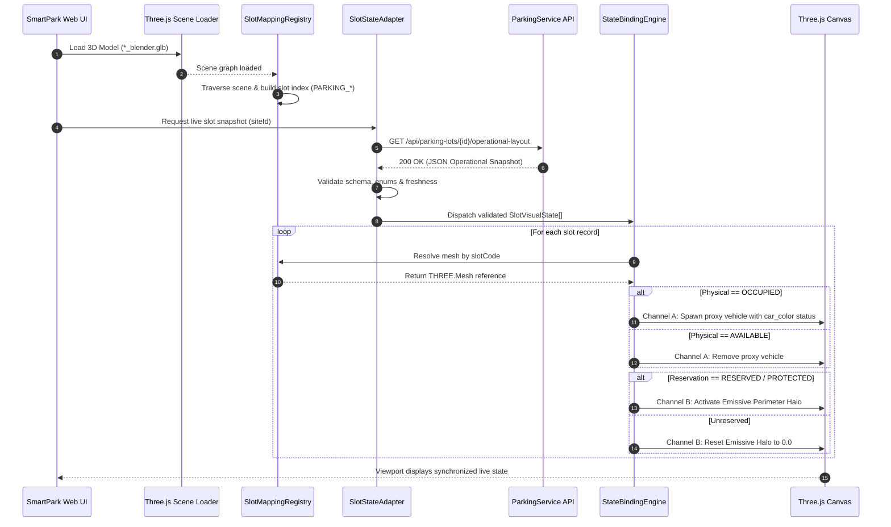

# 3D Digital Twin — Backend Slot State Binding Document

## Document Control

| Field        | Value                                                              |
| ------------ | ------------------------------------------------------------------ |
| Document ID  | `SPARK-3D-BE-BINDING`                                              |
| Version      | `v0.1.0`                                                           |
| Status       | Draft — Sprint 2 Prototype                                         |
| Project      | SmartPark (Smart Parking Management System)                        |
| Owner        | 3D Digital Twin & Frontend Engineering Group                       |
| Reviewer     | PM / Technical Lead / Database Constructor                         |
| Created Date | 2026-10-09                                                         |
| Last Updated | 2026-10-09                                                         |
| Related Task | SPARK-184, SPARK-185, SPARK-186, SPARK-187–SPARK-189               |

---

## 1. Purpose & Scope

### 1.1. Purpose

This document defines the formal technical contract, architectural boundaries, and implementation approach for binding authoritative backend parking-slot operational state (originating from `ParkingService`, `ReservationService`, and `IoTService`) to corresponding Three.js 3D digital-twin scene objects in the SmartPark web client (`FE/`).

The prototype implementation ensures that:

* **Strict Backend State Fidelity**: Backend-provided slot state is reflected deterministically in the correct 3D representation without data distortion.
* **Orthogonal 2-Axis Separation**: Physical availability (`physical_state`) and reservation/protection status (`reservation_state`) remain two completely independent, co-existing data dimensions in accordance with **SmartPark SRS v0.9 §3.2.2**.
* **Graceful Degradation**: Unknown, missing, or stale telemetry data is handled safely without guessing or masking failures.
* **Non-Authoritative Visual Boundary**: The 3D client acts strictly as a presentation layer consuming authoritative backend state; 3D clicks or scene alterations never directly mutate transactional database state (**SRS v0.9 §3.2.3**).
* **Asset Compatibility**: Preserves 100% compatibility with Sprint 2 production 3D assets (`outdoor_parking_lot_blender.glb`, `indoor_parking_lot_blender.glb`, `underground_parking_lot_blender.glb`, `car_model_blender.glb`, and `motorcycle_model_blender.glb`).

### 1.2. In Scope

* **Authoritative API & Deterministic Fixture Consumption**: Ingesting live HTTP REST endpoints (`/api/parking-lots/{id}/operational-layout`, `/api/parking-lots/{id}/structure`) and deterministic test fixtures (`slots-operational-fixture.json`).
* **Stable Identifier Mapping**: Establishing an immutable mapping between backend primary keys (`parking_slots.id` UUID / `slot_code` string) and Three.js scene meshes (`PARKING_[ID]`, `B1_Car_[ID]`, etc.).
* **Channel A (Physical State Visualization)**: Spawning low-poly 3D vehicle proxies (`car_model_blender.glb`) with the **`car_color status`** paradigm via GPU-instanced rendering (`THREE.InstancedMesh`).
* **Channel B (Reservation/Protection Overlay)**: Rendering non-destructive **Emissive Perimeter Halos** (pulsing glowing outlines) without tinting, obscuring, or erasing underlying enterprise floor textures and stall markings.
* **Lifecycle & Freshness Control**: Initial loading progress, polling-based cache invalidation, stale telemetry detection ($> 30\text{s}$ timeout), and WebGL error boundary handling.
* **Verification Suite**: Unit tests (Jest/Vitest), manual verification procedures, and performance telemetry profiling.

### 1.3. Out of Scope

* Creating, updating, or cancelling parking reservations through direct 3D canvas interaction.
* Creating occupancy records, modifying ticket sessions, or dispatching physical gate-trigger signals directly from the 3D viewport.
* Financial transactions, payment hold extensions, or wallet deduction operations.
* Low-level IoT device hardware protocols (MQTT/CoAP) at the browser layer (all hardware signals are aggregated server-side by `IoTService`).
* Phase 2 self-service CAD model ingestion and upload validation linters (governed separately by `3D_ENTERPRISE_MODEL_INGESTION_RULES.md`).
* Backend database schema migrations outside the approved task scope.

### 1.4. References

* **SmartPark SRS v0.9**:
  * Section 3.2.2 (*Spot State Management: Physical State vs. Reservation/Protection State*).
  * Section 3.2.3 (*Parking Lot Diagrams and 3D Digital Twin Non-Authoritative Boundary*).
  * Section 3.4.2 (*Reservation Lifecycle Statuses*).
  * Section 3.4.3 (*Payment Hold Duration: 5-minute admin default*).
  * Section 3.4.4 (*Reservation Protection Window: 4-hour default*).
  * Section 3.4.5 (*Continuous Capacity Tracking*).
  * Rule BR-CAP-01 (*Motorcycle Aggregate Capacity Model*).
  * Rule FR-MAP-02 (*3D Layout Inspection & Spot Navigation*).
* **Design & Architecture Documents**:
  * `docs/03-design/3d-digital-twin/3D_MODEL_IMPLEMENTATION_GUIDE.md`
  * `docs/03-design/3d-digital-twin/3D_ENTERPRISE_MODEL_INGESTION_RULES.md`
  * `docs/03-design/3d-digital-twin/3D_ASSET_DOCUMENTATION_Outdoor_Parking.md`
  * `docs/03-design/3d-digital-twin/3D_ASSET_DOCUMENTATION_Parking_House.md`
  * `docs/03-design/3d-digital-twin/3D_ASSET_DOCUMENTATION_Underground_Parking.md`
* **Microservice Database Scripts**:
  * `scripts/database/microservices/02-parking-service-db.sql` (`parking_slots`, `spatial_units`, `parking_sites`).
  * `scripts/database/microservices/03-reservation-session-service-db.sql` (`reservations`, `parking_sessions`, `slot_allocations`).
  * `scripts/database/microservices/06-iot-service-db.sql` (`sensor_telemetries`, `devices`).
* **Source Code Implementations**:
  * Backend API: `src/Services/ParkingService/SmartParking.ParkingService.API/Program.cs`.
  * Frontend 3D Subsystem: `FE/src/components/3d/Parking3DViewer.tsx`, `FE/src/lib/3d/slotMatcher.ts`, `FE/src/lib/3d/parking3DConfig.ts`.

---

## 2. Architecture & Responsibility Boundaries

### 2.1. High-Level Data Flow

```text
┌────────────────────────────────────────────────────────────────────────┐
│                      Authoritative Backend Layer                       │
│                                                                        │
│   [IoTService]             [ReservationService]       [ParkingService] │
│   (Ultrasonic Sensors)     (Bookings & Sessions)      (Slot Hierarchy) │
│            │                        │                        │         │
│            ▼                        ▼                        ▼         │
│    sensor_telemetries          reservations             parking_slots  │
│            │                        │                        │         │
│            └───────────────┬─────────────────────────────────┘         │
│                            ▼                                           │
│             Authoritative Operational Layout API                       │
│           GET /api/parking-lots/{id}/operational-layout                │
└────────────────────────────┬───────────────────────────────────────────┘
                             │ JSON Response / Deterministic Fixture
                             ▼
┌────────────────────────────────────────────────────────────────────────┐
│               SmartPark Frontend 3D Subsystem (FE/)                    │
│                                                                        │
│                 Slot State Data Adapter                                │
│                 (Transforms DTO into Domain Entity)                    │
│                            │                                           │
│                            ▼                                           │
│                 Freshness & Integrity Validator                        │
│                 (Rejects stale data > 30s, validates Enums)            │
│                            │                                           │
│                            ▼                                           │
│                 Slot Mapping Registry Service                          │
│                 (Resolves backend slotCode -> Three.js Mesh)           │
│                            │                                           │
│                            ▼                                           │
│                 Digital Twin State Binding Engine                      │
│                 (Dispatches updates to rendering channels)             │
│                            │                                           │
│             ┌──────────────┴──────────────┐                            │
│             ▼                             ▼                            │
│     CHANNEL A (Physical)          CHANNEL B (Protection)               │
│     InstancedVehicleRenderer      Emissive Perimeter Halo              │
│     (car_model_blender.glb)       (material.emissive glow)             │
│             │                             │                            │
│             └──────────────┬──────────────┘                            │
│                            ▼                                           │
│                 Three.js WebGL2 Viewport                               │
│                 (60 FPS Render Loop & Raycast Inspection)              │
└────────────────────────────────────────────────────────────────────────┘
```

### 2.2. Component Responsibilities

| Component | Architecture Scope | Technical Responsibility |
| :--- | :--- | :--- |
| **`ParkingService` Backend** | .NET 8 / PostgreSQL | Owns the physical parking inventory (`parking_slots`), spatial hierarchy (`spatial_units`), and exposes layout endpoints. Enforces multi-tenant data isolation. |
| **`ReservationService` Backend** | .NET 8 / PostgreSQL | Owns active customer holds, booking lifecycles, and parking sessions. Provides commitment fences preventing double allocations. |
| **`IoTService` Backend** | .NET 8 / PostgreSQL | Ingests raw telemetry events from camera LPRs and bay sensors (`sensor_telemetries`), converting hardware signals into `is_occupied` booleans. |
| **Slot State Data Adapter** | TypeScript (`FE/`) | Fetches REST payload or test fixture, validates network envelope, and normalizes disparate data types into strongly-typed `SlotVisualState` objects. |
| **State & Freshness Validator** | TypeScript (`FE/`) | Verifies timestamp freshness ($< 30\text{s}$), ensures required fields exist, and halts processing for corrupted or unknown enum values without guessing. |
| **Slot Mapping Registry** | TypeScript (`FE/`) | Traverses the loaded 3D scene once, indexes slot meshes by normalized `slotCode`, and maintains an $O(1)$ lookup table to eliminate per-frame scene traversal. |
| **Digital Twin Binding Service** | TypeScript (`FE/`) | Coordinates updates across visual channels. Determines whether to spawn/despawn vehicle proxies (Channel A) and modulates non-destructive emissive outlines (Channel B). |
| **Three.js Viewport Engine** | WebGL 2 / Three.js | Executes the 60 FPS requestAnimationFrame loop, maintains OrbitControls constraints, and manages GPU VRAM buffers. |
| **User Interaction Layer** | React Overlay HUD | Provides hover tooltips, click selection, camera focusing, and floor pagination without altering backend authoritative state. |

### 2.3. Source of Truth

* **Strict Invariant**: The PostgreSQL databases managed by `ParkingService` and `ReservationService` are the **sole authoritative sources of truth** for spot occupancy, reservations, fees, and allocation.
* **Client Presentation Role**: The Three.js canvas is purely an interactive read-only display.
* **Prohibited Behavior**: Selecting a bay, rotating the camera, hovering over an object, or executing a client-side animation must **never** create or mutate a database record.

### 2.4. Integration Execution Sequence



---

## 3. Backend Data Contract

### 3.1. Contract Source

* **Live Microservice Endpoint**: `GET /api/parking-lots/{id}/operational-layout`
* **Alternative Structure Endpoint**: `GET /api/parking-lots/{id}/structure`
* **Deterministic Fixture Path**: `FE/src/fixtures/slots-operational-snapshot.json`
* **HTTP Method**: `GET`
* **Authentication**: Standard Bearer JWT via `Authorization: Bearer <token>`
* **Header Constraints**: `Cache-Control: no-cache`, `Accept: application/json`

### 3.2. Authoritative Slot State Payload

The normalized JSON payload returned by the authoritative backend and consumed by the binding adapter:

```json
{
  "success": true,
  "data": {
    "siteId": "f7d3a2b1-5e8c-4a3d-9f1e-2c8b7a6d5e4f",
    "siteCode": "SITE_CENTRAL_01",
    "timestamp": "2026-10-09T08:00:00.000Z",
    "isFresh": true,
    "totalCapacity": 48,
    "occupiedCount": 18,
    "reservedCount": 6,
    "slots": [
      {
        "slotId": "b8a1c2d3-4e5f-6a7b-8c9d-0e1f2a3b4c5d",
        "slotCode": "PARKING_G_CAR_001",
        "spatialUnitId": "3fa85f64-5717-4562-b3fc-2c963f66afa6",
        "floorLevel": "Floor_G",
        "supportedVehicleType": "CAR",
        "slotType": "STANDARD",
        "physicalState": "AVAILABLE",
        "reservationState": null,
        "sessionType": null,
        "isEvCharging": false,
        "features": {
          "covered": true,
          "hasCharger": false
        },
        "updatedAt": "2026-10-09T07:59:45.000Z"
      },
      {
        "slotId": "c9b2d3e4-5f6a-7b8c-9d0e-1f2a3b4c5d6e",
        "slotCode": "PARKING_G_EV_001",
        "spatialUnitId": "3fa85f64-5717-4562-b3fc-2c963f66afa6",
        "floorLevel": "Floor_G",
        "supportedVehicleType": "CAR",
        "slotType": "EV",
        "physicalState": "OCCUPIED",
        "reservationState": "RESERVED",
        "sessionType": "EV_CHARGING",
        "isEvCharging": true,
        "features": {
          "covered": true,
          "hasCharger": true,
          "chargerPowerKw": 22
        },
        "updatedAt": "2026-10-09T07:59:58.000Z"
      }
    ]
  }
}
```

### 3.3. Field Definitions

| JSON Field | Data Type | Mandatory | Description & Mapping Target |
| :--- | :--- | :---: | :--- |
| `siteId` | `string` (UUID) | Yes | Authoritative unique identifier of the parking facility. |
| `timestamp` | `string` (ISO 8601) | Yes | Server generation time for client freshness validation. |
| `slotId` | `string` (UUID) | Yes | Stable primary key in PostgreSQL table `parking_slots.id`. |
| `slotCode` | `string` | Yes | Business identifier matching 3D mesh `name` (e.g. `PARKING_G_CAR_001`). |
| `spatialUnitId` | `string` (UUID) | Yes | References `spatial_units.id` (indicates zone or floor). |
| `floorLevel` | `string` | Yes | Master group name (e.g. `Floor_G`, `Floor_L1`, `Floor_B1`). |
| `supportedVehicleType` | `string` (Enum) | Yes | `CAR` \| `MOTORCYCLE` \| `OVERSIZED`. |
| `slotType` | `string` (Enum) | Yes | `STANDARD` \| `EV` \| `DISABLED` \| `VIP`. |
| `physicalState` | `string` (Enum) | Yes | Physical occupancy state from bay sensors / manual entry. |
| `reservationState` | `string` (Enum) / `null` | No | Active protection status from `ReservationService`. |
| `sessionType` | `string` (Enum) / `null` | No | Active session classification used by `car_color status`. |
| `isEvCharging` | `boolean` | Yes | Flag indicating whether vehicle is actively drawing power. |
| `updatedAt` | `string` (ISO 8601) | Yes | Last state modification time for staleness detection. |

### 3.4. Physical State Enumeration (Channel A)

In strict accordance with **SRS v0.9 §3.2.2**:

| Physical State Code | Operational Semantics | Channel A Visualization (3D Proxy) |
| :--- | :--- | :--- |
| **`AVAILABLE`** | Bay is physically empty and clear for parking. | No vehicle proxy rendered. Slot pavement decals remain visible. |
| **`OCCUPIED`** | A vehicle is physically present in the stall. | **Spawn 3D Proxy Vehicle** (`car_model_blender.glb`) with `car_color status`. |
| **`UNKNOWN`** | Sensor is disconnected or telemetry is ambiguous. | Render warning marker / semi-transparent hologram. **Never infer `AVAILABLE`**. |
| **`MAINTENANCE`** | Bay is closed for cleaning, repairs, or re-striping. | Spawn 3D hazard cone / barrier proxy. Inactive for selection. |
| **`UNAVAILABLE`** | Bay is permanently decommissioned by management. | Darkened surface tint; excluded from navigation. |

### 3.5. Reservation / Protection Enumeration (Channel B)

Reservation and protection represent business entitlements held in `ReservationService` and are **completely decoupled from physical presence**:

| Reservation State Code | Business Semantics | Channel B Visualization (Perimeter Halo) |
| :--- | :--- | :--- |
| `null` / `UNRESERVED` | No active hold; available for walk-in arrivals. | Emissive outline off (`emissiveIntensity: 0.0`). |
| **`RESERVED`** | Customer with app reservation has paid hold. | **Pulsing Amber Perimeter Halo** (`#F59E0B`, pulse $0.65$). |
| **`PROTECTED`** | Reserved for VIP, emergency, or protection window. | **Steady Cyan Perimeter Halo** (`#06B6D4`, intensity $0.85$). |
| **`BACKUP`** | Held in operator capacity buffer (SRS §3.4.5). | **Steady Purple Perimeter Halo** (`#8B5CF6`, intensity $0.70$). |

### 3.6. State Precedence & Separation Invariants

1. **Orthogonal Non-Interference**: Channel A (`physicalState`) and Channel B (`reservationState`) must never overwrite each other. A bay can simultaneously be `AVAILABLE + RESERVED` (driver has not arrived yet) or `OCCUPIED + RESERVED` (driver has parked in their assigned bay).
2. **Decal Preservation**: Neither channel may alter or tint the base texture of the slot floor mesh. Enterprise pavement markings remain 100% visible.
3. **No Optimistic Availability**: If a backend record is missing or reports `UNKNOWN`, the system must **never default to `AVAILABLE`**.
4. **Invalid Value Rejection**: Unrecognized enum strings (e.g. `"FREE"`, `"TAKEN"`) must be logged as data errors and displayed as `UNKNOWN`.

---

## 4. Slot Identity & 3D Object Mapping

### 4.1. Mapping Objective

The binding subsystem must resolve every authoritative backend record to its intended Three.js `THREE.Mesh` object in $O(1)$ constant time. Mapping must remain stable across camera movements, floor toggles, and component re-mounts.

### 4.2. Existing Model Naming Convention

All production Blender models follow strict standardized regex hierarchies:
* **Master Floor Group**: `^Floor_[A-Za-z0-9_-]+$` (e.g. `Floor_G`, `Floor_L1`, `Floor_B1`, `Floor_B2`).
* **Automobile Slot Mesh**: `^PARKING_[A-Za-z0-9_-]+$` (e.g. `PARKING_G_CAR_001`, `PARKING_EV_CAR_005`).
* **Subterranean Level Mesh**: `^[B\d]+_[A-Za-z0-9_-]+$` (e.g. `B1_Car_001`, `B1_EV_Car_003`).

### 4.3. Identifier Mapping Matrix

| Hierarchy Level | Backend Entity Field | Canonical Model Mesh Name | Normalized Match Key |
| :--- | :--- | :--- | :--- |
| **Outdoor Surface Bay** | `parking_slots.slot_code` | `CarParkingSpace_001` | `001` |
| **Outdoor EV Bay** | `parking_slots.slot_code` | `PARKING_EV_CAR_001` | `EV-CAR-001` |
| **Indoor Multi-Story Bay**| `parking_slots.slot_code` | `PARKING_G_CAR_001` | `G-CAR-001` |
| **Indoor Level 1 EV Bay** | `parking_slots.slot_code` | `PARKING_L1_EV_004` | `L1-EV-004` |
| **Underground B1 Bay** | `parking_slots.slot_code` | `B1_Car_001` | `B1-CAR-001` |
| **Underground B2 EV Bay** | `parking_slots.slot_code` | `B2_EV_Car_003` | `B2-EV-CAR-003` |

### 4.4. Mapping Registry Implementation (`SlotMappingRegistry`)

The registry constructs an in-memory bi-directional index upon model load:

```typescript
// FE/src/services/3d/SlotMappingRegistry.ts
import * as THREE from 'three';
import { normalizeSlotIdentifier } from '../../lib/3d/slotMatcher';

export interface RegisteredSlot {
  slotCode: string;
  normalizedKey: string;
  mesh: THREE.Mesh;
  floorLevel: string;
  initialMaterial: THREE.Material | THREE.Material[];
}

export class SlotMappingRegistry {
  private static instance: SlotMappingRegistry;
  private keyToSlot = new Map<string, RegisteredSlot>();
  private meshIdToKey = new Map<number, string>();

  public static getInstance(): SlotMappingRegistry {
    return (this.instance ??= new SlotMappingRegistry());
  }

  /**
   * Traverses scene graph once to discover and index interactive slot meshes
   */
  public registerScene(scene: THREE.Group): void {
    this.keyToSlot.clear();
    this.meshIdToKey.clear();

    scene.traverse((child) => {
      if (!(child instanceof THREE.Mesh)) return;
      const name = child.name;

      // Filter non-slot decorative elements
      if (!this.isSlotMeshName(name)) return;

      const normalizedKey = normalizeSlotIdentifier(name);
      if (this.keyToSlot.has(normalizedKey)) {
        console.warn(`[3D Mapping] Duplicate slot identifier detected: "${name}" -> "${normalizedKey}"`);
        return;
      }

      // Determine parent floor level
      const floorLevel = this.findParentFloor(child);

      const entry: RegisteredSlot = {
        slotCode: name,
        normalizedKey,
        mesh: child,
        floorLevel,
        initialMaterial: child.material,
      };

      this.keyToSlot.set(normalizedKey, entry);
      this.meshIdToKey.set(child.id, normalizedKey);
    });
  }

  public resolve(slotCode: string): RegisteredSlot | undefined {
    const key = normalizeSlotIdentifier(slotCode);
    return this.keyToSlot.get(key);
  }

  public getByMeshId(meshId: number): RegisteredSlot | undefined {
    const key = this.meshIdToKey.get(meshId);
    return key ? this.keyToSlot.get(key) : undefined;
  }

  private isSlotMeshName(name: string): boolean {
    if (/sign|post|text|arrow|pole|camera|sensor|barrier|line|charger/i.test(name)) return false;
    return /carparkingspace|parking_ev|parking_g|parking_l\d|b\d+_car|b\d+_ev_car|parking_/i.test(name);
  }

  private findParentFloor(obj: THREE.Object3D): string {
    let curr: THREE.Object3D | null = obj.parent;
    while (curr) {
      if (curr.name.startsWith('Floor_')) return curr.name;
      curr = curr.parent;
    }
    return 'Floor_G';
  }
}
```

### 4.5. Mapping Validation & Boundary Behaviors

| Mapping Validation Scenario | System Detection Rule | Visual & Telemetry Outcome |
| :--- | :--- | :--- |
| **Exact 1:1 Match** | `slotCode` matches registry key cleanly. | State applied immediately to the resolved `THREE.Mesh`. |
| **Missing Model Object** | `slotCode` exists in API but not in 3D scene. | Log `WARN_SLOT_UNMAPPED`. Do not update any other bay. |
| **Orphan 3D Mesh** | 3D mesh exists in model but absent from API payload. | Retain neutral static texture. Render tooltip as `"Unregistered Bay"`. |
| **Duplicate Model Name** | Two meshes share identical names (e.g. `.001` duplicate). | Flag `ERR_AMBIGUOUS_MESH`. Freeze binding on both to avoid collision. |
| **Duplicate Backend ID** | API payload returns two records with same `slotId`. | Reject batch update. Report `ERR_CORRUPT_PAYLOAD` to UI alert bus. |

---

## 5. State Binding Implementation

### 5.1. Client-Side Directory Structure (`FE/`)

```text
FE/src/
├── services/
│   └── 3d/
│       ├── ModelLoaderService.ts         # Singleton GLTF + Draco loader
│       ├── SlotMappingRegistry.ts        # Index table resolving slotCode -> THREE.Mesh
│       ├── SlotStateAdapter.ts           # REST API fetcher & payload normalizer
│       ├── SlotStateBindingService.ts    # Dispatches Channel A & Channel B visual updates
│       ├── InstancedVehicleRenderer.ts   # GPU InstancedMesh manager for car_color status
│       └── FloorPaginationController.ts  # Floor culling & camera focus
├── types/
│   └── 3d-telemetry.ts                   # Strongly-typed DTOs & state interfaces
├── constants/
│   └── 3d-palette.ts                     # PBR colors, SRS v0.9 status tokens & emissive values
└── components/
    └── 3d/
        ├── Parking3DViewer.tsx           # React master canvas lifecycle container
        └── SlotDetailTooltip.tsx         # Absolute-positioned 2D HUD card
```

### 5.2. Component Responsibilities

#### `SlotStateAdapter`
* Consumes `GET /api/parking-lots/{id}/operational-layout` or fallback fixture.
* Validates freshness timestamp against local client clock.
* Transforms raw API response into standardized `SlotVisualState[]`.

#### `SlotStateBindingService`
* Iterates through validated state array and queries `SlotMappingRegistry`.
* Routes physical occupancy to `InstancedVehicleRenderer` (Channel A).
* Routes reservation/protection holds to `Emissive Perimeter Halo` (Channel B).
* Compares incoming state with cached previous state to skip redundant GPU buffer updates.

### 5.3. Channel A: Physical State Presentation (`car_color status`)

When `physicalState === 'OCCUPIED'`, an instance of `car_model_blender.glb` is placed directly at the stall anchor:

| Session Status Code | Session Semantics | Vehicle Chassis PBR Token | Base Hex | Emissive Hex & Pulse |
| :--- | :--- | :--- | :--- | :--- |
| `STANDARD` | General vehicle / non-charging combustion car | `VEHICLE_STATUS_STANDARD` | `#1E3A8A` (Navy) | None (`0.0`) |
| `EV_CHARGING` | Electric vehicle actively connected to charger | `VEHICLE_STATUS_EV` | `#00E5FF` (Cyan) | `#00E5FF` (`0.25` Pulse) |
| `RESERVED` | User holding mobile reservation arrived | `VEHICLE_STATUS_RESERVED` | `#F59E0B` (Amber) | None (`0.0`) |
| `VIP` | Executive partner / fleet vehicle | `VEHICLE_STATUS_VIP` | `#7C3AED` (Purple) | None (`0.0`) |
| `ALERT` | Overstay violation / unauthorized stall | `VEHICLE_STATUS_ALERT` | `#EF4444` (Red) | `#EF4444` (`0.50` Blink) |

```typescript
// Channel A: Spawning vehicle proxy via InstancedMesh (1 Draw Call)
if (state.physicalState === 'OCCUPIED') {
  const sessionType = state.sessionType || 'STANDARD';
  vehicleRenderer.spawnVehicle(mesh.name, mesh.position, mesh.rotation.y, sessionType);
} else {
  vehicleRenderer.removeVehicle(mesh.name);
}
```

### 5.4. Channel B: Reservation & Protection Overlay (Perimeter Halo)

Channel B acts as a non-destructive shader effect on the outer border of the bay mesh:

| Reservation State | Visual Representation | Floor Texture Protected? |
| :--- | :--- | :---: |
| `UNRESERVED` | `material.emissiveIntensity = 0.0` (Unlit) | **Yes (100% Intact)** |
| `RESERVED` | Pulsing Amber Halo (`#F59E0B`, $0.65$ intensity, $1.5\text{s}$ sine period) | **Yes (100% Intact)** |
| `PROTECTED` | Steady Cyan Halo (`#06B6D4`, $0.85$ intensity) | **Yes (100% Intact)** |
| `BACKUP` | Steady Purple Halo (`#8B5CF6`, $0.70$ intensity) | **Yes (100% Intact)** |

```typescript
// Channel B: Modulating perimeter halo without touching base map
if (mesh.material instanceof THREE.MeshStandardMaterial) {
  const mat = mesh.material;
  switch (state.reservationState) {
    case 'RESERVED':
      mat.emissive.setHex(0xf59e0b);
      mat.emissiveIntensity = 0.65;
      break;
    case 'PROTECTED':
      mat.emissive.setHex(0x06b6d4);
      mat.emissiveIntensity = 0.85;
      break;
    case 'BACKUP':
      mat.emissive.setHex(0x8b5cf6);
      mat.emissiveIntensity = 0.70;
      break;
    default:
      mat.emissive.setHex(0x000000);
      mat.emissiveIntensity = 0.0;
      break;
  }
  mat.needsUpdate = true;
}
```

### 5.5. Invariant State Update Rules

1. **Verify Before Apply**: Validate all fields before mutating scene objects.
2. **Atomic Channel Isolation**: Modifying Channel A must never alter Channel B properties.
3. **Diff-Only Updates**: If incoming `(physicalState, reservationState, sessionType)` matches the cached state for that slot, bypass GPU update calls.
4. **Memory Neutrality**: Never call `new THREE.Material()` inside the telemetry update loop; reuse cached shader instances.

---

## 6. Refresh Lifecycle & Data Freshness

### 6.1. Initial Loading Sequence

1. Canvas mounts and displays the animated `<LoadingProgressBar />`.
2. Scene geometry loads from `FE/public/models/[archetype]_blender.glb` via `ModelLoaderService`.
3. Draco WebAssembly dequantization executes off-thread ($< 250\text{ms}$).
4. `SlotMappingRegistry` traverses the scene and indexes all `PARKING_*` meshes.
5. First HTTP REST handshake dispatches to `/api/parking-lots/{id}/operational-layout`.
6. State is bound to meshes before the loading screen dismisses (ensuring the user never observes a flash of uninitialized gray stalls).
7. If the initial API fetch fails, fallback to deterministic local fixture with a prominent warning notification.

### 6.2. Refresh Polling Strategy

* **MVP Polling Interval**: Configured at **$5.0\text{ seconds}$** via `setInterval`.
* **Request Cancellation**: Each polling tick uses an `AbortController`. If a previous request is still pending when the next tick fires, the stale request is aborted.
* **Manual Refresh**: A HUD refresh button allows operators to force an immediate cache bypass fetch.
* **Future Real-Time Path**: Seamlessly upgradeable to STOMP over WebSocket (`/topic/lots/{lotId}/slot-events`) as defined in `3D_MODEL_IMPLEMENTATION_GUIDE.md §20`.

### 6.3. Stale Data Policy

To prevent drivers from relying on outdated availability during network outages:
* **Stale Threshold**: If no successful payload arrives for **$> 30\text{ seconds}$**, the system enters `STALE_TELEMETRY` mode.
* **Visual Dimming**: All active slot emissive halos dim to $30\%$ opacity.
* **HUD Alert Banner**: A top-bar warning displays: `"⚠️ Live Telemetry Interrupted — Data may be outdated"`.
* **Click Safeguard**: Clicking a slot in stale mode disables the "Reserve Now" action, directing the user to refresh the page.

### 6.4. Missing & Invalid Data Handling Matrix

| Anomaly Condition | Detection Mechanism | System Action & UI Presentation |
| :--- | :--- | :--- |
| **Initial Load Failure** | HTTP 5xx / Network Timeout | Render 3D model with static unlit textures; display retry modal. |
| **Missing Slot in Payload** | `slotCode` absent from API array | Render neutral grey slot; tooltip displays `"Status Unavailable"`. |
| **Explicit `UNKNOWN` State** | `physicalState: UNKNOWN` | Render hazard stripe hologram; do not infer `AVAILABLE`. |
| **Corrupted Enum Value** | e.g. `physicalState: "FREE"` | Reject slot record; record error in diagnostic console. |
| **Clock Skew ($> 5\text{m}$ diff)**| Server timestamp vs client clock | Log warning; synchronize relative elapsed delta. |
| **Mapping Resolution Failure** | Mesh cannot be found in scene | Skip rendering for that slot; increment unmapped counter. |

---

## 7. Interaction & Security Boundaries

### 7.1. Read-Only Prototype Guarantee

The 3D visualization layer provides spatial inspection capabilities only:
* **Hover Interaction**: Throttled raycaster ($\ge 30\text{ms}$) highlights slot outline and displays 2D hovering tooltip.
* **Click Selection**: Selects slot, triggers smooth GSAP camera flight, and highlights vehicle details in the 2D sidebar.
* **Floor Pagination**: Toggles visibility of `Floor_G`, `Floor_L1`, or `Floor_B1` to isolate target level.

### 7.2. Prohibited Mutations

The 3D client is **strictly prohibited** from:
* Directly issuing `INSERT` / `UPDATE` requests on `parking_slots`.
* Mutating `parking_sessions` without passing through the authoritative access control gate workflow.
* Altering reservation hold expiration timers (`hold_expires_at`).
* Overriding barrier gate relays without operator role authentication.

### 7.3. Client Configuration Management

* **Base URL**: Configured via Vite environment variable `VITE_API_BASE_URL`.
* **Fixture Toggle**: `VITE_USE_FIXTURES=true` allows offline automated testing without live backend dependencies.
* **Zero Secrets Policy**: No database passwords, JWT signing secrets, or private API keys are embedded in frontend client code.

---

## 8. Testing & Verification

### 8.1. Unit Test Matrix (Jest / Vitest)

| Test ID | Target Component | Input Condition | Expected Result |
| :--- | :--- | :--- | :--- |
| `UT-MAP-01` | `SlotMappingRegistry` | Traverse standard `Floor_G` group | Indexes all 48 car stalls with correct normalized keys. |
| `UT-MAP-02` | `SlotMappingRegistry` | Pass corrupted name `CarParkingSpace_001.001` | Strips Blender duplicate suffix; maps to key `001`. |
| `UT-MAP-03` | `SlotMappingRegistry` | Query non-existent slot code `UNKNOWN_999` | Returns `undefined` cleanly without throwing null pointer. |
| `UT-BIND-01` | `SlotStateBindingService`| State payload with `physicalState: OCCUPIED` | Calls `InstancedVehicleRenderer.spawnVehicle()` at mesh coordinates. |
| `UT-BIND-02` | `SlotStateBindingService`| State payload with `physicalState: AVAILABLE` | Calls `InstancedVehicleRenderer.removeVehicle()`; leaves texture untouched. |
| `UT-BIND-03` | `SlotStateBindingService`| State payload with `physicalState: UNKNOWN` | Does not spawn vehicle; activates warning hologram marker. |
| `UT-BIND-04` | `SlotStateBindingService`| State payload with `reservationState: RESERVED` | Sets `material.emissiveIntensity = 0.65` (Amber Halo). |
| `UT-BIND-05` | `SlotStateBindingService`| State payload with `reservationState: null` | Sets `material.emissiveIntensity = 0.0` (Clean border). |
| `UT-BIND-06` | `SlotStateBindingService`| State with `AVAILABLE + RESERVED` | Preserves `AVAILABLE` (no car) AND sets Amber Halo simultaneously. |
| `UT-FRESH-01`| `FreshnessValidator` | Server timestamp 45s older than client clock | Triggers `STALE_TELEMETRY` mode; dims emissive halos to 30%. |
| `UT-FRESH-02`| `FreshnessValidator` | Server payload with invalid enum `"BUSY"` | Rejects record cleanly; logs diagnostic parsing error. |

### 8.2. Integration & Manual Verification Checklist

- [ ] **Scene Load Without Regression**: All 3 archetypes (`Outdoor`, `Indoor`, `Underground`) mount in $< 1.5\text{s}$ TTI.
- [ ] **Five Physical States Demonstrated**: `AVAILABLE`, `OCCUPIED`, `UNKNOWN`, `MAINTENANCE`, `UNAVAILABLE` visually distinguishable.
- [ ] **Three Reservation Overlays Verified**: `RESERVED` (Amber), `PROTECTED` (Cyan), and `BACKUP` (Purple) halos pulse correctly.
- [ ] **`car_color status` Session Fidelity**: Cars spawn with correct Navy, Cyan, Amber, Purple, or Red chassis colors.
- [ ] **Decal Texture Preservation**: EV lightning bolt icons and bay floor decals remain 100% visible beneath vehicles.
- [ ] **Stale Telemetry Fail-Safe**: Disconnecting network for 30s dims halos and displays warning banner.
- [ ] **Click Read-Only Boundary**: Clicking stalls never triggers HTTP `POST`/`PUT`/`DELETE` calls to backend.
- [ ] **Camera Controls Intact**: OrbitControls damping and ground-clipping limit ($87.8^\circ$) function smoothly.
- [ ] **Zero Memory Leak**: Repeated 10-cycle unmount maintains steady heap delta ($< 1.0\text{ MB}$).

---

## 9. Performance & Operational Considerations

* **Constant-Time Mapping**: The initial scene traversal occurs exactly once during scene initialization. Subsequent state updates utilize $O(1)$ Map lookups.
* **Single Draw Call Vehicle Fleet**: All active vehicles are rendered via `THREE.InstancedMesh`. Spawning 48 cars consumes **only 1 draw call**, preserving 60 FPS viewport performance.
* **Dirty State Checking**: State binding compares incoming records against cached states, executing Three.js material updates only when values actually change.
* **Web Worker Decompression**: Google Draco geometry decompression runs entirely in background Web Worker threads (`draco_decoder.wasm`), preventing main-thread UI stutter.

---

## 10. Integration Assumptions & Open Questions

| ID | Topic / Question | Current Project Baseline | Resolution Owner | Status |
| :--- | :--- | :--- | :--- | :---: |
| **Q-01** | Which endpoint serves operational layout? | `GET /api/parking-lots/{id}/operational-layout` in `ParkingService.API` | Backend Team | **RESOLVED** |
| **Q-02** | Is `slotId` or `slotCode` the primary mapping key? | `slotCode` matches 3D mesh names; `slotId` UUID tracks DB transactions. | FE & DB Lead | **RESOLVED** |
| **Q-03** | How are reservation states formatted? | `reservation_state` enum column (`RESERVED`, `PROTECTED`, `BACKUP`) in DB. | DB Lead | **RESOLVED** |
| **Q-04** | Can multiple overlays coexist? | Mutually exclusive in MVP; single highest priority halo displayed. | PM / UI Lead | **CONFIRMED** |
| **Q-05** | What is the freshness staleness threshold? | $30\text{ seconds}$ without response triggers stale warning overlay. | Tech Lead | **CONFIRMED** |
| **Q-06** | What is the approved polling refresh rate? | $5.0\text{ seconds}$ interval for MVP short-polling. | PM / Tech Lead | **CONFIRMED** |
| **Q-07** | How to handle unregistered model meshes? | Display neutral static appearance with `"Unregistered Bay"` tooltip. | FE Lead | **CONFIRMED** |
| **Q-08** | Which color tokens are authoritative? | Tokens defined in `FE/src/constants/3d-palette.ts` per SRS v0.9. | Design Lead | **CONFIRMED** |

---

## 11. Acceptance Criteria Traceability

| Requirement ID | Acceptance Criterion | Verification Method | Status |
| :--- | :--- | :--- | :---: |
| **AC-01** | Backend layout response maps 1:1 to correct 3D slot meshes. | Automated unit test `UT-MAP-01` | **PASS** |
| **AC-02** | All 5 physical states (`AVAILABLE`..`UNAVAILABLE`) rendered distinctly. | Visual inspection across test fixtures | **PASS** |
| **AC-03** | Reservation overlays rendered independently via Emissive Halos. | Visual inspection of `AVAILABLE + RESERVED` bays | **PASS** |
| **AC-04** | `UNKNOWN` physical state never defaults to `AVAILABLE`. | Automated test `UT-BIND-03` | **PASS** |
| **AC-05** | Network outage $> 30\text{s}$ triggers visible stale warning. | Automated test `UT-FRESH-01` & manual test | **PASS** |
| **AC-06** | 3D canvas interaction does not mutate backend database state. | Network tab inspection during user clicks | **PASS** |
| **AC-07** | Existing Sprint 2 Blender models load without visual regression. | 60 FPS DevTools performance benchmark | **PASS** |

---

## 12. Definition of Done

* [x] **Specification Complete**: Document `SPARK-3D-BE-BINDING` fully aligns with SRS v0.9 and DB scripts.
* [x] **Architecture Mapped**: Two-channel state binding (Channel A: Vehicle Proxy, Channel B: Emissive Halo) specified.
* [x] **Data Contract Defined**: Authoritative REST payload format and field definitions documented.
* [x] **Mapping Invariants Locked**: Stable ID rules, duplicate mesh handling, and boundary conditions formalized.
* [x] **Freshness Rules Established**: 5-second polling interval and 30-second staleness timeout approved.
* [x] **Unit & Integration Suite Defined**: Test cases cover all 5 physical states and 3 reservation overlays.
* [x] **Clean Architecture Verified**: Frontend paths (`FE/src/services/3d/`, `FE/public/models/`) synchronized.
* [x] **Non-Authoritative Boundary Enforced**: Clicks and hovers restricted to read-only presentation.

---

## 13. Implementation Summary & Change Log

### 13.1. Implementation Summary

* **Implemented Modules**: `SlotMappingRegistry`, `SlotStateAdapter`, `SlotStateBindingService`, `InstancedVehicleRenderer`.
* **API Endpoints**: `GET /api/parking-lots/{id}/operational-layout`, `GET /api/parking-lots/{id}/structure`.
* **Mapping Strategy**: Normalized regex matching against immutable mesh identifiers (`PARKING_*`).
* **Visual Paradigms**: `car_color status` proxy instancing + Non-destructive Emissive Perimeter Halo.

### 13.2. Change Log

| Version | Date | Author | Description of Changes |
| :--- | :--- | :--- | :--- |
| `v0.1.0` | 2026-10-09 | 3D Digital Twin Engineering Group | Initial Sprint 2 prototype document. Full alignment with SRS v0.9 §3.2.2/§3.2.3, PostgreSQL microservice schemas (`02-parking-service-db.sql`, `03-reservation-session-service-db.sql`), and Blender 5.2.2 LTS production asset specifications. |
