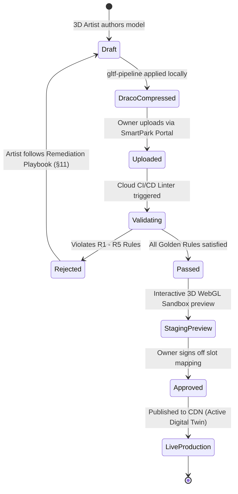

# SmartPark Phase 2 — Enterprise 3D Model Ingestion Rules & Asset Formatting Specification

**Document Reference**: `3D_ENTERPRISE_MODEL_INGESTION_RULES.md`  
**System Reference**: SmartPark / Parking Lot Management System (Phase 2 Multi-Tenant SaaS)  
**Baseline Standard**: SmartPark SRS v0.8.5 (§3.2.3 Non-authoritative Digital Twin, Performance SLA < 3s, BR-CAP-01, BR-VEH-03)  
**Target Audience**: B2B Enterprise Facility Owners, 3D Artists (Blender / 3ds Max / Spline / Revit), Frontend Engineers, QA / CI/CD DevOps  
**Language**: English (Official Compliance Standard)  
**Status**: Active Specification  
**Last Updated**: 2026-10-06  

---

## 1. EXECUTIVE SUMMARY & PURPOSE

### 1.1. Context: Zero-Code Frontend Ingestion
In SmartPark Phase 2 (Commercial Multi-Tenant SaaS), commercial facility owners (shopping malls, office towers, airports, convention centers) can onboard their own bespoke parking facilities. 

To eliminate costly custom frontend development for every new client, the SmartPark Web Application utilizes a **Generic Rule-Based Three.js Engine**. This engine does **not** hardcode specific mesh names or facility geometries. Instead, it dynamically traverses, parses, colorizes, paginates, and attaches real-time telemetry to any external 3D model that conforms to this specification.

```text
3D Architectural File (.glb) ──▶ Automated Linter Pipeline ──▶ SmartPark Three.js Engine ──▶ 60 FPS Digital Twin
         (External)                     (Validation)                     (Zero-Code)                  (Web/Mobile)
```

### 1.2. Purpose of This Specification
This document defines the **mandatory technical rules, naming conventions, geometric budgets, and scene graph structures** required for external 3D models. It serves two functions:
1. **The Compliance Rulebook**: Criteria that all uploaded 3D assets must pass before being published to the SmartPark production CDN.
2. **The Formatting & Remediation Playbook**: Actionable instructions for 3D artists and engineers to diagnose and fix rejected models.

---

## 2. THE GOLDEN RULES (COMPLIANCE SUMMARY)

Every external `.glb` model must pass all 6 compliance gates:

| # | Compliance Pillar | Golden Rule Requirement | Linter Severity |
| :---: | :--- | :--- | :---: |
| **R1** | **File Format & Draco** | Binary `.glb` format, compressed with Draco (`cl 7`). Download size $\le 8.0\text{ MB}$ ($\le 25.0\text{ MB}$ uncompressed). | **CRITICAL (Blocker)** |
| **R2** | **Coordinate System & Scale** | Right-handed coordinate system, $+Y$ Up, 1 Unit = 10mm (or 1:1 metric scale). Scene pivot placed at ground center $(0, 0, 0)$. | **CRITICAL (Blocker)** |
| **R3** | **Scene Graph Hierarchy** | Strict 2-tier tree structure: Model Root $\rightarrow$ `Floor_[Level]` Group $\rightarrow$ Functional Mesh Groups $\rightarrow$ Meshes. | **CRITICAL (Blocker)** |
| **R4** | **Semantic Naming** | Parking slots prefixed with `PARKING_[ID]`; floors prefixed with `Floor_[Level]`. Dedicated EV slots contain `_EV_`. | **CRITICAL (Blocker)** |
| **R5** | **Mesh & Geometry Budget** | Total scene triangle count $\le 250,000$. Max active draw calls $\le 250$. No static vehicle meshes baked into the facility model. | **WARNING / Blocker** |
| **R6** | **PBR Material Neutrality** | Models must be exported without proprietary third-party shaders. SmartPark PBR Engine applies materials programmatically at runtime. | **INFO / Auto-Fix** |

---

## 3. RULE 1: FILE FORMAT, PACKAGING & PERFORMANCE BUDGET

### 3.1. Required Packaging
* **File Container**: Binary glTF format (`.glb`). ASCII `.gltf` with detached `.bin` or texture files is **strictly rejected**.
* **Embedded Textures**: Any textures (if used) must be embedded directly inside the `.glb` container. External image dependencies are rejected.
* **Draco Quantization**: The model must be compressed using Google Draco geometry compression.

### 3.2. Performance & Payload SLA (< 3.0s SLA)
In compliance with the SmartPark performance SLA, models must load and render interactively in **under 3.0 seconds** over standard broadband / 4G cellular connections ($20 - 40\text{ Mbps} \approx 2.5 - 5.0\text{ MB/s}$):

```
+-------------------------------------------------------------------------------------------------+
| Parameter                        Threshold Budget     Rationale                                 |
+-------------------------------------------------------------------------------------------------+
| Uncompressed File Size           <= 25.0 MB           Prevents WebGL context crash & GPU OOM    |
| Draco-Compressed File Size       <= 8.0 MB            Ensures swift network transfer (target <4)|
| Total Triangle / Polygon Count   <= 250,000 tris      Prevents mobile GPU frame drop (capped)   |
| Total Active Draw Calls          <= 250 calls         Maintains 60 FPS rendering on mobile GPUs |
| Total Scene Meshes               <= 500 individual    Prevents CPU scene graph traversal delays |
+-------------------------------------------------------------------------------------------------+
```

### 3.3. How to Quantize & Compress (CLI Recipe)
Use `gltf-pipeline` to format and compress your asset:
```bash
# Install tool globally
npm install -g gltf-pipeline

# Run Draco compression with level 7
gltf-pipeline -i my_parking_facility.glb -o my_parking_facility_draco.glb -d --draco.compressionLevel 7
```

---

## 4. RULE 2: COORDINATE SYSTEM, SCALE & SPATIAL ANCHORING

```
           +Y (Height / Up)
            ▲
            │
            │   ┌──────────────┐
            │  /              /│
            │ /              / │
            │┌──────────────┐  │
            ││  Facility    │  │
            ││              │ /
            │└──────────────┘/
            └────────────────────────► +X (Width)
           /
          /
         ▼
       +Z (Depth)
       Ground Center = (0, 0, 0)
```

1. **Up-Axis**: $+Y$ must point vertically upwards. Models authored in Blender (where $+Z$ is up) must be exported with **Y Up conversion enabled**.
2. **Coordinate Handedness**: Standard right-handed coordinate system (glTF 2.0 standard).
3. **World Origin Anchor**:
   * The ground plane center (or main entrance point) must sit at $(X: 0, Y: 0, Z: 0)$.
   * Basements must occupy negative $Y$ coordinates ($Y < 0$).
   * Above-ground floors must occupy positive $Y$ coordinates ($Y > 0$).
4. **Scale Ratio**: $1\text{ unit} = 10\text{mm}$ (or $1\text{ unit} = 1\text{m}$ normalized). All sub-meshes must have their transformation matrices **frozen / applied** (`Scale: 1.0, 1.0, 1.0`; `Rotation: 0, 0, 0`).

---

## 5. RULE 3: SCENE GRAPH HIERARCHY (THE 2-TIER TREE)

The SmartPark Three.js Engine uses a strict 2-tier tree to perform **zero-overhead floor isolation** (Floor Culling) and camera focus. Flattened scenes (all objects at root) will fail validation.

### 5.1. Mandatory Scene Tree Structure
```text
Root Scene (Scene / Page)
│
├── Floor_[LevelIdentifier]          <-- Level Group (e.g. Floor_G, Floor_1, Floor_B1)
│   │
│   ├── CarParking                   <-- Functional Group: Automobile bays
│   │   ├── PARKING_A01              <-- Individual Slot Mesh
│   │   ├── PARKING_A02
│   │   └── ...
│   │
│   ├── MotorcycleParking            <-- Functional Group: 2-wheeler bays/strip zones
│   │   ├── MotorcycleZone_M1
│   │   └── ...
│   │
│   ├── DrivingLanes                 <-- Functional Group: Traffic paths & arrows
│   │   ├── DrivingLane_Main
│   │   └── DirectionalArrow_01
│   │
│   ├── Facilities                   <-- Functional Group: Walls, slabs, columns, lights
│   │   ├── Floor_Slab
│   │   ├── Perimeter_Wall
│   │   └── Structural_Column_01
│   │
│   └── AccessInfrastructure         <-- Functional Group: Ramps, boom gates, kiosks
│       ├── Entrance_BoomGate
│       └── InterLevel_Ramp
│
└── Floor_[NextLevelIdentifier]      <-- Next Level Group (e.g. Floor_2, Floor_B2)
    └── ...
```

> [!IMPORTANT]
> **No Orphan Meshes**: Every visual mesh in the model must reside inside its respective `Floor_[Level]` group. Do not place individual parking slots directly in the scene root.

---

## 6. RULE 4: SEMANTIC NAMING CONVENTIONS

The frontend engine applies business logic, styling, and database synchronization via **Semantic Regex Pattern Matching**. Object names must strictly follow these rules:

### 6.1. Floor Level Naming Rules
* Pattern: `^Floor_[A-Za-z0-9_-]+$`
* Examples:
  * `Floor_G` (Ground level)
  * `Floor_1`, `Floor_2`, `Floor_3` (Upper levels)
  * `Floor_B1`, `Floor_B2` (Basement levels)
  * `Floor_Roof` (Rooftop open deck)

### 6.2. Parking Slot Naming Rules (Automobile & EV)
Parking slot meshes represent physical bays that users can inspect and reserve.
* **Standard Automobile Slot**: Must start with `PARKING_` followed by an alphanumeric slot code.  
  * Pattern: `^PARKING_[A-Za-z0-9_-]+$`
  * Examples: `PARKING_A01`, `PARKING_1F_12`, `PARKING_B1_04`
* **Dedicated EV Charging Slot**: Must include `_EV_` in the node name.  
  * Examples: `PARKING_EV_01`, `PARKING_B1_EV_04`, `_EV_Car_Slot_1`
* **EV Charging Hardware Post / Kiosk**: Must contain `EV_Charger`.  
  * Examples: `EV_Charger_01`, `DualGun_EV_Charger_Top`

### 6.3. Motorcycle Zone Naming Rules
In accordance with **SRS BR-CAP-01**, motorcycle areas are aggregate capacity zones (not individual stalls).
* Pattern: Must contain `MotorcycleZone_` or `MOTO_`
* Examples: `MotorcycleZone_East`, `MotorcycleZone_B1_A`, `MOTO_STRIP_01`
* **VinFast Battery Swap Kiosk**: Must contain `Vinfast_` or `Battery_Swap`.  
  * Examples: `Vinfast_Swap_Station_01`, `Vinfast_Kiosk_East`

### 6.4. Infrastructure & Architecture Naming Rules
To allow automatic material application (PBR shading), structure objects should contain recognizable semantic tags:
* **Floor Slabs / Ground**: `Floor`, `Ground`, `Asphalt`, `Tarmac`, `Slab`
* **Road Markings / Paint Lines**: `Line`, `Marking`, `Divider`, `Arrow`
* **Structural Elements**: `Column`, `Pillar`, `Wall`, `Ceiling`, `Beam`
* **Access Waypoints**: `Ramp`, `Gate`, `Entrance`, `Exit`, `Elevator`, `Stairs`

---

## 7. RULE 5: GEOMETRY & RENDERING CONSTRAINTS

### 7.1. Banned Techniques
1. **Pre-baked Vehicle Meshes**: Do **NOT** export permanent 3D car models sitting in parking slots. The SmartPark frontend dynamically instantiates cars using `InstancedMesh` based on live database occupancy. Baked cars permanently obstruct slot color feedback.
2. **Embedded Heavy Light Sources**: Do **NOT** embed dozens of PointLights or SpotLights. Use unlit materials or emissive shader values (`emissiveIntensity`). SmartPark provides a performant 2-light ambient rig.
3. **Excessive Mesh Fragmentation**: Do not split a single road into 200 tiny polygon fragments. Merge static architectural meshes by material before export.

### 7.2. Geometric Budgets per Facility Type
* **Single Surface Open-Air Facility**: $\le 60,000$ triangles, $\le 80$ draw calls.
* **Multi-Level Garage (3-4 Floors)**: $\le 180,000$ triangles, $\le 180$ draw calls.
* **Subterranean Garage (2-3 Basements)**: $\le 250,000$ triangles, $\le 250$ draw calls.

---

## 8. RULE 6: MATERIALS & PBR PALETTE COMPLIANCE

### 8.1. Why glTF Models Default to Grey Clay
Third-party tools (Spline, Blender Shader Nodes, 3ds Max Corona/V-Ray) use proprietary mathematical node graphs. During standard `.glb` export, these complex graphs cannot be encoded and are stripped, defaulting all objects to monochrome grey.

### 8.2. SmartPark Zero-Shader Runtime Policy
External clients **do not need to spend days texture baking**. The SmartPark WebGL runtime uses an automated semantic material override system (`ColorMaterialService`):

```typescript
// The SmartPark Engine automatically matches keywords to industrial PBR tokens:
if (name.includes('Floor') || name.includes('Tarmac')) applyPBR(0x272e3b, roughness 0.85);
if (name.includes('Line') || name.includes('Marking'))  applyPBR(0xfbbf24, roughness 0.40);
if (name.includes('_EV_'))                             applyPBR(0x00e5ff, roughness 0.30);
if (name.includes('Vinfast_'))                         applyPBR(0x0f766e, roughness 0.30);
```

**What the 3D Artist Needs to Do**:
* Simply assign separate mesh objects for different architectural elements.
* Give each mesh an accurate semantic name following Rule 4.
* Let the SmartPark PBR Engine handle visual styling, reflectivity, and live occupancy states automatically.

---

## 9. RULE 7: DATABASE & SLOT SYNCHRONIZATION

The 3D model represents a direct digital twin of the backend database. In Phase 2 onboarding, the facility owner registers their slot inventory (SRS FR-LOT-01 / FR-LOT-03).

### 9.1. Slot Count Reconciliation
$$\text{Count}(\text{Meshes matching } \text{\textasciigrave PARKING\_*\textasciigrave}) == \text{Total Active Automobile Slots in Database}$$

If the owner's database registration states the garage has **85 car slots**, but the uploaded 3D model contains **92 meshes starting with `PARKING_`**, the automated validation pipeline will generate a discrepancy warning:
`WARN_SLOT_MISMATCH: Model contains 92 slots; Database profile specifies 85.`

### 9.2. Slot Code Matching
The slot code in the 3D model node must match the database `slot_code`:
* 3D Node Name: `PARKING_B1_24`
* Backend DB Record: `parking_slot.slot_code = "B1_24"` (Prefix `PARKING_` stripped).

---

## 10. AUTOMATED VALIDATION PIPELINE & ERROR CODES

During Phase 2 self-service onboarding, uploaded models pass through a serverless linter. Below is the error code matrix:

```
+-----------------------------------------------------------------------------------------------+
| Error Code        Severity    Description                         Remediation                 |
+-----------------------------------------------------------------------------------------------+
| ERR_FMT_001       BLOCKER     File is not binary .glb             Export as GLTF Binary (.glb)|
| ERR_SIZE_002      BLOCKER     File exceeds 25.0MB (uncompressed)  Reduce geometry / simplify  |
| ERR_DRACO_003     BLOCKER     Missing Draco compression           Run gltf-pipeline CLI       |
| ERR_TREE_004      BLOCKER     Missing Floor_* root groups         Group meshes by floor level |
| ERR_SLOT_005      BLOCKER     Zero PARKING_* slots found          Rename bay meshes           |
| ERR_POLY_006      WARNING     Triangle count > 250,000            Apply Decimate modifier     |
| ERR_AXIS_007      WARNING     Model bounding box Y inverted       Re-export with +Y Up axis   |
| WARN_SLOT_SYNC    WARNING     3D slot count != DB record count    Reconcile with Admin portal |
+-----------------------------------------------------------------------------------------------+
```

---

## 11. REMEDIATION PLAYBOOK (COMMON FIXES FOR 3D ARTISTS)

### Issue A: "My model was rejected with `ERR_TREE_004: Missing Floor_* root groups`"
* **Cause**: Your objects are all placed loosely in the top-level scene.
* **Fix (Blender / Spline)**:
  1. Create an empty group / parent node named `Floor_1` (or `Floor_G`).
  2. Select all objects belonging to that floor (slabs, parking bays, walls, columns).
  3. Parent them into `Floor_1`.
  4. Repeat for other floors (`Floor_2`, `Floor_B1`).

### Issue B: "My model was rejected with `ERR_SLOT_005: Zero PARKING_* slots found`"
* **Cause**: Parking spaces are named `Cube.001`, `Plane_Slot`, `Space_A`, etc.
* **Fix**:
  1. Rename parking stall floor meshes to follow the syntax: `PARKING_A01`, `PARKING_A02`, etc.
  2. For EV bays, rename to `PARKING_EV_01` or include `_EV_`.

### Issue C: "The file is too heavy (> 10MB) and fails `ERR_SIZE_002`"
* **Cause**: High-poly cylinder bevels, 3D text characters, or excessive subdivision surfaces.
* **Fix**:
  1. Remove baked 3D text (room numbers, instructions). SmartPark uses 2D HTML/CSS overlays for typography.
  2. Reduce curve bevel resolution on structural railings and pipes.
  3. In Blender, select high-poly meshes and apply a **Decimate Modifier** (`Ratio: 0.3 - 0.5`).

### Issue D: "The facility renders underground or sideways in the web app"
* **Cause**: Incorrect coordinate export settings.
* **Fix**:
  1. In Blender: Press `Ctrl + A` $\rightarrow$ **Apply All Transforms**.
  2. In Export GLTF window: Ensure **Transform $\rightarrow$ +Y Up** is checked.
  3. Move the ground floor entrance to $(0, 0, 0)$ world coordinates before exporting.

---

## 12. SUBMISSION & VERIFICATION LIFECYCLE



---

## 13. DEVELOPER QUICK REFERENCE (LINTER PSEUDO-CODE)

For DevOps and backend engineers building the Phase 2 Automated Validator:

```typescript
// scripts/validate-3d-model.ts
import { NodeIO } from '@gltf-transform/core';
import { KHRDracoMeshCompression } from '@gltf-transform/extensions';

export async function validateParkingModel(glbBuffer: Buffer) {
  const io = new NodeIO().registerExtensions([KHRDracoMeshCompression]);
  const document = await io.readBinary(new Uint8Array(glbBuffer));
  const root = document.getRoot();

  // 1. Draco check
  const dracoExt = root.listExtensionsUsed().some(ext => ext.extensionName === 'KHR_draco_mesh_compression');
  if (!dracoExt) throw new Error('ERR_DRACO_003: Model must be compressed with Draco');

  // 2. Hierarchy & Naming check
  const scene = root.listScenes()[0];
  const topNodes = scene.listChildren();
  const floorNodes = topNodes.filter(n => /^Floor_[A-Za-z0-9_-]+$/.test(n.getName()));
  if (floorNodes.length === 0) throw new Error('ERR_TREE_004: Missing Floor_* root groups');

  // 3. Slot count check
  let slotCount = 0;
  for (const node of root.listNodes()) {
    if (node.getName().startsWith('PARKING_')) slotCount++;
  }
  if (slotCount === 0) throw new Error('ERR_SLOT_005: Zero PARKING_* slots found in model');

  return { status: 'PASSED', floors: floorNodes.length, slots: slotCount };
}
```

---

## 14. ENTERPRISE ONBOARDING COMPLIANCE TERMS & DIGITAL INGESTION AGREEMENT

This section provides the ready-to-integrate UI copy, legal/technical terms, and AI-assisted remediation prompt that can be embedded directly into the **SmartPark Owner Web Portal** (at the 3D Model Onboarding / Upload stage).

### 14.1. Portal UI Modal / Agreement Copy (Embeddable Content)

> #### 📋 SmartPark 3D Digital Twin — Enterprise Ingestion Terms & Technical Agreement
>
> Prior to uploading your custom 3D parking lot model (`.glb`), please read and accept the following technical conditions. Models that do not comply with these specifications will fail the automated ingestion linter and cannot be published to the live driver app.
>
> ---
>
> **1. Structural & Naming Compliance (Rules R2 & R4)**  
> All models must be grouped into designated floor nodes (`Floor_G`, `Floor_1`, `Floor_B1`, etc.) and parking slot meshes must strictly follow the `PARKING_[ID]` naming prefix (with `_EV_` for electric vehicle bays). Flattened meshes or unregistered naming schemes will be blocked automatically.
>
> **2. Database & Slot Count Reconciliation (Rule R7 & SRS FR-LOT-03)**  
> The count of physical 3D bays (`PARKING_*`) within your uploaded file must match the registered capacity entered in your Facility Profile. Any numerical discrepancy will trigger an automated validation warning.
>
> **3. Performance Budget & Mandatory Draco Compression (Rule R1 & Performance SLA < 3s)**  
> To guarantee sub-3-second load times on broadband/4G networks, uploaded models must not exceed **8.0 MB** (Draco compressed) or **25.0 MB** (raw). The total scene polygon count must remain under **250,000 triangles**, and active draw calls under **250 calls**. Static vehicle meshes must **not** be baked into the parking stalls.
>
> **4. Non-Authoritative Visualization Boundary (SRS §3.2.3)**  
> The 3D Digital Twin is an interactive visualization viewer only. All parking availability, reservations, pricing, and access control transactions remain strictly authoritative within the SmartPark Backend Cloud.
>
> **5. Automated Dynamic PBR Styling (Rule R6)**  
> glTF exports strip custom proprietary 3D authoring shader graphs. SmartPark automatically styles your facility using our industrial PBR design token palette based on your semantic node names.
>
> ---
>
> #### 🤖 AI-Assisted Auto-Formatting Kit for 3D Artists & Architects
> If your existing CAD, BIM, Revit, or Blender model does not yet match these naming rules, you do not need to rename hundreds of slots manually!
> 
> 📥 **[Download SmartPark 3D Compliance Rule Kit (.MD)](./3D_ENTERPRISE_MODEL_INGESTION_RULES.md)**
>
> *Prompt for your Enterprise AI Assistant (ChatGPT / Claude / Gemini / Copilot):*
> ```text
> "I have an architectural 3D model of a parking lot. Please review the attached SmartPark 3D Compliance Rule Kit (3D_ENTERPRISE_MODEL_INGESTION_RULES.md). Generate a Python script for Blender that iterates through all meshes in my scene, organizes them into a 2-tier tree under 'Floor_[Level]', renames parking bays to 'PARKING_[ID]', decimate meshes if triangles exceed 250,000, and applies Draco compression on export."
> ```
>
> ---
>
> **Acceptance & Confirmation:**
> - [ ] **I have reviewed the SmartPark 3D Digital Twin Specification Kit and confirmed our model adheres to the 6 Golden Rules.**
> - [ ] **I understand that failed validation checks will require re-exporting the model following the Remediation Playbook.**
>
> `[ Download 3D Rule Kit (.MD) ]` &nbsp;&nbsp;&nbsp;&nbsp; `[ I Accept Terms & Proceed to Upload GLB ]`

---

### 14.2. Embeddable React / TypeScript UI Agreement Component

For frontend engineers implementing the Enterprise Onboarding Wizard:

```tsx
// components/owner-portal/ModelAgreementModal.tsx
import React, { useState } from 'react';

interface ModelAgreementModalProps {
  isOpen: boolean;
  onAccept: () => void;
  onCancel: () => void;
}

export const ModelAgreementModal: React.FC<ModelAgreementModalProps> = ({ isOpen, onAccept, onCancel }) => {
  const [hasReviewedRules, setHasReviewedRules] = useState(false);
  const [hasAcknowledgedSla, setHasAcknowledgedSla] = useState(false);

  if (!isOpen) return null;

  return (
    <div className="fixed inset-0 z-50 flex items-center justify-center bg-black/60 p-4">
      <div className="w-full max-w-2xl rounded-2xl bg-white p-6 shadow-2xl dark:bg-gray-900 dark:text-white">
        <h2 className="text-xl font-bold text-gray-900 dark:text-white">
          SmartPark 3D Model Ingestion Compliance Agreement
        </h2>
        <p className="mt-2 text-sm text-gray-600 dark:text-gray-300">
          Ensure your 3D parking lot model (.glb) strictly complies with our Performance SLA &lt; 3s,
          2-tier scene hierarchy, and semantic naming standards prior to ingestion.
        </p>

        <div className="my-4 max-h-60 overflow-y-auto rounded-lg border border-gray-200 bg-gray-50 p-4 text-xs text-gray-700 dark:border-gray-700 dark:bg-gray-800 dark:text-gray-200 space-y-2">
          <p><strong>1. Hierarchy & Naming:</strong> Meshes must be grouped under Floor_* and slots prefixed with PARKING_*.</p>
          <p><strong>2. Performance Budget:</strong> Max file size &le; 8MB (Draco) / &le; 25MB (raw), &le; 250,000 triangles, &le; 250 draw calls.</p>
          <p><strong>3. Slot Reconciliation:</strong> 3D slots must reconcile 100% with your registered lot capacity.</p>
          <p><strong>4. Dynamic Styling:</strong> Standard glTF models will be styled programmatically using SmartPark PBR tokens.</p>
        </div>

        <div className="rounded-lg bg-blue-50 p-3 text-xs text-blue-800 dark:bg-blue-950 dark:text-blue-200">
          💡 <strong>Need help reformatting?</strong> Download the rule specification and provide it to your AI:
          <div className="mt-1 font-semibold underline cursor-pointer">
            <a href="/docs/3D_ENTERPRISE_MODEL_INGESTION_RULES.md" download>
              ⬇️ Download SmartPark 3D Rule Specification Kit (.MD)
            </a>
          </div>
        </div>

        <div className="mt-4 space-y-2 text-sm">
          <label className="flex items-center gap-2 cursor-pointer">
            <input
              type="checkbox"
              checked={hasReviewedRules}
              onChange={(e) => setHasReviewedRules(e.target.checked)}
              className="rounded text-blue-600"
            />
            <span>I have reviewed the 3D Specification Kit and verified model compliance.</span>
          </label>
          <label className="flex items-center gap-2 cursor-pointer">
            <input
              type="checkbox"
              checked={hasAcknowledgedSla}
              onChange={(e) => setHasAcknowledgedSla(e.target.checked)}
              className="rounded text-blue-600"
            />
            <span>I acknowledge that non-compliant models will be rejected by the automated linter.</span>
          </label>
        </div>

        <div className="mt-6 flex justify-end gap-3">
          <button
            onClick={onCancel}
            className="rounded-lg px-4 py-2 text-sm text-gray-600 hover:bg-gray-100 dark:text-gray-300"
          >
            Cancel
          </button>
          <button
            disabled={!hasReviewedRules || !hasAcknowledgedSla}
            onClick={onAccept}
            className="rounded-lg bg-blue-600 px-5 py-2 text-sm font-semibold text-white disabled:opacity-50 hover:bg-blue-700"
          >
            Accept Terms & Proceed to Upload
          </button>
        </div>
      </div>
    </div>
  );
};
```

