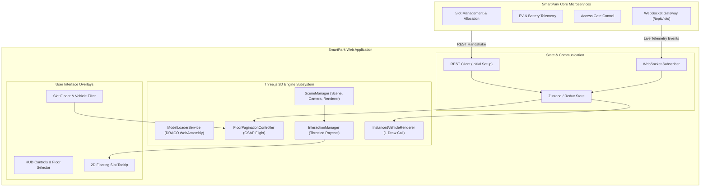

# SmartPark 3D Digital Twin — Master Model Implementation Guide

**Document Reference**: `3D_MODEL_IMPLEMENTATION_GUIDE.md`  
**System Reference**: SmartPark / Parking Lot Management System  
**Baseline Standard**: SmartPark SRS v0.8.5 (Performance SLA < 3s, Non-authoritative Digital Twin §3.2.3, BR-CAP-01, BR-VEH-03, C-23)  
**Technical Architecture Reference**: SmartPark Solution Architecture v0.8.5 (3D WebGL Subsystem)  
**Target Audience**: Frontend Engineers, 3D Artists, UI/UX Designers, Solution Architects, Project Managers  
**Language**: English (Official Technical Reference)  
**Status**: Approved for Implementation  
**Last Updated**: 2026-10-05  

---

## TABLE OF CONTENTS

1. [Document Information](#1-document-information)
2. [Purpose and Scope](#2-purpose-and-scope)
3. [Prerequisites](#3-prerequisites)
4. [Technology Stack](#4-technology-stack)
5. [3D Asset Overview](#5-3d-asset-overview)
6. [Asset Structure](#6-asset-structure)
7. [Target System Architecture](#7-target-system-architecture)
8. [Project / File Structure](#8-project--file-structure)
9. [Asset Preparation & Draco Compression](#9-asset-preparation--draco-compression)
10. [Installation and Dependencies](#10-installation-and-dependencies)
11. [Basic 3D Model Integration](#11-basic-3d-model-integration)
12. [GLB Loading & Memory Caching](#12-glb-loading--memory-caching)
13. [Scene Setup](#13-scene-setup)
14. [Camera Setup & Vantage Configuration](#14-camera-setup--vantage-configuration)
15. [Lighting Setup](#15-lighting-setup)
16. [Material and Color Management (Proposal for Manager Approval)](#16-material-and-color-management-proposal-for-manager-approval)
17. [Object Identification and Mapping](#17-object-identification-and-mapping)
18. [Parking Slot Integration](#18-parking-slot-integration)
19. [Vehicle Integration (Sedans & Motorcycles)](#19-vehicle-integration-sedans--motorcycles)
20. [Backend Data Integration](#20-backend-data-integration)
21. [Runtime State Visualization](#21-runtime-state-visualization)
22. [User Interaction & Throttled Raycasting](#22-user-interaction--throttled-raycasting)
23. [Camera / Navigation Controls & Floor Pagination](#23-camera--navigation-controls--floor-pagination)
24. [UI Integration & Overlay Tooltips](#24-ui-integration--overlay-tooltips)
25. [Performance Optimization (SLA < 3s & 60 FPS)](#25-performance-optimization-sla--3s--60-fps)
26. [Responsive & Browser Considerations](#26-responsive--browser-considerations)
27. [Error Handling & Fallbacks](#27-error-handling--fallbacks)
28. [Testing & Profiling](#28-testing--profiling)
29. [Troubleshooting Guide](#29-troubleshooting-guide)
30. [Security & Asset Access](#30-security--asset-access)
31. [Deployment & CDN Configuration](#31-deployment--cdn-configuration)
32. [Implementation Checklist](#32-implementation-checklist)
33. [Known Limitations](#33-known-limitations)
34. [Future Improvements](#34-future-improvements)
35. [Developer Notes & Cheat Sheet](#35-developer-notes--cheat-sheet)

---

## 1. DOCUMENT INFORMATION

| Attribute | Specification |
| :--- | :--- |
| **Document ID** | `DOC-3D-IMPL-001` |
| **Title** | SmartPark 3D Digital Twin Master Model Implementation Guide |
| **Version** | `v1.1.0` (Production Baseline) |
| **Primary System** | SmartPark Parking Lot Management & Reservation System |
| **Source Standards** | SmartPark SRS v0.8.5, Solution Architecture v0.8.5 |
| **Primary Authors** | Antigravity AI Architecture Team & Lead Frontend Engineers |
| **Review / Sign-off** | Project Manager, Tech Lead, UI/UX Lead |

---

## 🧭 QUICK NAVIGATION & KEY IMPLEMENTATION SECTIONS MAP

For engineers, technical leads, and code reviewers, use this curated map to immediately jump to critical implementation modules without reading through all 35 sections sequentially:

```
+-----------------------------------------------------------------------------------------------------------------------+
|  Implementation Goal                  Target Sections         Key Technical Artifacts & Purpose                       |
+-----------------------------------------------------------------------------------------------------------------------+
|  1. Strategic Architecture & Roadmap  Section 2.3, 2.4, 34    Phase 1 (MVP Catalog) vs Phase 2 (Commercial SaaS).     |
|                                                               5-Pillar Zero-Code Design Contract & CI/CD Linter.      |
|                                                               Related: 3D_ENTERPRISE_MODEL_INGESTION_RULES.md         |
|                                                                                                                       |
|  2. Clean Project & File Structure    Section 8               Standard Next.js/React layout (components/3d,           |
|                                                               services/3d, types/3d.ts, constants/3d-palette.ts).      |
|                                                                                                                       |
|  3. Draco Compression (< 3s SLA)      Section 9, 25           gltf-pipeline CLI commands, 4G transfer calculation     |
|                                                               (~1.14s), and 60 FPS / <150 draw call budget caps.      |
|                                                                                                                       |
|  4. PBR Colors & Manager Proposal     Section 16              Overcomes Spline grey clay export. Pros/Cons approval   |
|                                                               table & SMARTPARK_PBR_PALETTE design token dictionary.  |
|                                                                                                                       |
|  5. Slot Identification & State Sync  Section 17, 18, 20      Regex node mapping (PARKING_*, _EV_, Vinfast_).         |
|                                                               WebSocket telemetry integration (SRS §3.2.3 boundary).  |
|                                                                                                                       |
|  6. High-Performance Vehicles         Section 19              Spawns 500+ cars/bikes with THREE.InstancedMesh         |
|                                                               consuming only 1 Draw Call per vehicle type.            |
|                                                                                                                       |
|  7. Floor Culling & Find My Spot      Section 23              FloorPaginationController (isolates active level,       |
|                                                               disables matrix updates) + GSAP camera navigation.      |
|                                                                                                                       |
|  8. Pre-PR Developer Checklist        Section 32              10-point self-audit checklist before merging code.      |
+-----------------------------------------------------------------------------------------------------------------------+
```

---

## 2. PURPOSE AND SCOPE

### 2.1. Purpose
This document provides an end-to-end technical blueprint for software engineers to integrate, render, optimize, and connect 3D parking models into the SmartPark web application. It bridges the gap between raw 3D modeling outputs and runtime enterprise WebGL presentation.

### 2.2. Scope
This guide governs all 3D digital twin assets deployed across SmartPark:
* **Multi-Level Garage**: `indoor_parking_lot.glb` (Ground, Level 1, Level 2, Rooftop deck).
* **Open-Air Facility**: `outdoor_parking_lot.glb` (Surface tarmac, EV fast-chargers, VinFast swap kiosks).
* **Subterranean Garage**: `underground_parking_lot.glb` (Basement 1, Basement 2, street portal, inter-level ramps).
* **Dynamic Vehicle Models**: `car_model.glb` (Passenger sedan), `motorcycle_model.glb` (Electric/gas 2-wheeler).

### 2.3. Architectural Roadmap: Phase 1 MVP vs. Phase 2 Commercial SaaS
To ensure the SmartPark platform avoids custom code re-engineering for future clients while delivering immediate MVP value, this implementation enforces a two-phase architecture:
* **Phase 1 (Current MVP Baseline — Standardized Catalog)**:
  * SmartPark provides 3 verified facility archetypes (Parking House, Outdoor, Underground).
  * Facility Owners select an archetype during onboarding (SRS FR-LOT-01 / FR-LOT-02).
  * The frontend runtime uses a generic, rule-based Three.js engine that treats all models uniformly.
* **Phase 2 (Post-MVP — Commercial SaaS & Multi-Tenant Self-Service)**:
  * Enterprise B2B clients (malls, airports, hospitals) upload their own bespoke 3D models via the Owner Portal.
  * An automated cloud CI/CD linter validates and compresses incoming `.glb` files against the **Digital Twin Design Contract**.
  * **Zero Frontend Code Changes**: Because the Three.js Engine is architected around generic design tokens and semantic naming conventions rather than hardcoded geometries, arbitrary compliant models load and operate immediately.

### 2.4. The 5-Pillar Digital Twin Design Contract
This document serves as the formal specification contract given to developers and 3D modeling vendors:
1. **Naming Contract (§6.2, §17)**: Standardized prefixes (`Floor_[Level]`, `PARKING_[ID]`, `_EV_`, `Vinfast_`) ensure programmatic floor culling and backend database synchronization.
2. **Hierarchy Contract (§6.2)**: Strict 2-tier scene tree allows instant floor pagination without traversing thousands of individual meshes.
3. **Performance & Compression Contract (§9, §25)**: Strict file size ($\le 25\text{ MB}$ raw, $\le 8\text{ MB}$ Draco) and draw call budgets ($\le 250$) guaranteeing the **< 3.0s initial render SLA**.
4. **PBR Material & Design Token Contract (§16)**: Dynamic runtime shader colorization eliminates the grey clay artifact of raw `.glb` exports without requiring manual material re-baking.
5. **Non-Authoritative State Contract (§7, §20)**: Complete decoupling of 3D rendering from business transactions, adhering strictly to SRS §3.2.3.

---

## 3. PREREQUISITES

Before starting implementation, ensure your development workstation meets the following criteria:
* **Node.js Environment**: Node.js `v18.0.0` or higher (`v20.x` LTS recommended).
* **Package Manager**: `npm` `v9+` or `pnpm` `v8+`.
* **3D Optimization CLI**: `gltf-pipeline` installed globally for Draco asset quantization.
* **Target Browsers**: Modern evergreen browsers supporting **WebGL 2.0** and **WebAssembly** (Chrome 90+, Edge 90+, Firefox 88+, Safari 15+).
* **Hardware Profile**: Any standard device with WebGL hardware acceleration (dedicated GPU or modern integrated graphics e.g. Intel Iris Xe, Apple Silicon, AMD Radeon).

---

## 4. TECHNOLOGY STACK

The 3D visualization layer is built upon industry-standard, lightweight web technologies:

| Component | Technology | Rationale |
| :--- | :--- | :--- |
| **UI Framework** | **React / Next.js (TypeScript)** | Declarative UI state, reactive hooks, robust micro-frontend modularity. |
| **3D WebGL Engine** | **Three.js (`three` r160+)** | Industry-standard WebGL abstraction, extensive documentation, tree-shakeable. |
| **Geometry Decompression** | **Google Draco (WebAssembly)** | 75–80% network payload reduction decoded asynchronously on Web Workers. |
| **Cinematic Motion** | **GSAP (GreenSock)** | Sub-pixel camera flight, floor transitions, and pulsing emissive highlights. |
| **Real-Time Data Bus** | **STOMP over WebSocket** | Sub-second state synchronization with SmartPark microservices. |
| **Model Authoring** | **Spline / Blender** | Scene assembly, coordinate alignment, and `.glb` binary export. |

---

## 5. 3D ASSET OVERVIEW

All production binary assets reside in the project repository at `docs/03-design/3d-digital-twin/src_model/`:

| Asset File | Size (Raw) | Size (Draco) | Total Objects | Role in SmartPark |
| :--- | :--- | :--- | :--- | :--- |
| `indoor_parking_lot.glb` | **5.67 MB** | **~1.38 MB** | 544 | Multi-level indoor structure with 4 floors and vertical ramp circulation. |
| `outdoor_parking_lot.glb` | **8.21 MB** | **~1.95 MB** | 471 | Surface lot with 30 car stalls (6 EV), 2 motorcycle zones, 2 VinFast kiosks. |
| `underground_parking_lot.glb` | **12.81 MB** | **~2.85 MB** | 496 | Subterranean 2-level diorama (B1 + B2), access portal, safety walls. |
| `car_model.glb` | **431 KB** | **~95 KB** | 13 | Low-poly sedan spawned inside occupied car stalls. |
| `motorcycle_model.glb` | **138 KB** | **~38 KB** | 12 | Low-poly motorcycle for capacity zone density rendering. |

---

## 6. ASSET STRUCTURE

### 6.1. Coordinate System & Scale Conventions
* **Coordinate System**: Three.js standard **Right-Handed Coordinate System** where:
  * $+X$ points **Right / East**.
  * $+Y$ points **Up / Vertical Elevation**.
  * $+Z$ points **Front / South / Toward Camera**.
* **Scale Unit**: $1\text{ unit} = 10\text{ mm} = 1\text{ cm}$. A standard automobile stall measures approximately $132\times 240\text{ units}$ ($1.32\text{ m}\times 2.40\text{ m}$).

### 6.2. Master Floor & Grouping Standards
Every 3D parking lot model follows an identical, strict 2-tier master grouping architecture:
```text
Model Root (Page)
├── Floor_[Level]               <-- Master Floor Node (e.g. Floor_G, Floor_B1)
│   ├── CarParking              <-- Standard & Dedicated EV Car bays
│   ├── MotorcycleParking       <-- Capacity strip zones & VinFast swap stations
│   ├── DrivingLanes            <-- Lanes, dividers, pedestrian paths, road arrows
│   ├── Facilities              <-- Slabs, perimeter walls, columns, beams, lights
│   ├── AccessInfrastructure    <-- Ramps, portals, boom gates, scanning kiosks
│   ├── InterLevelRamp          <-- Sloped connecting ramps between floors
│   ├── Elevator                <-- Vertical core elevator lobby
│   └── Staircase               <-- Emergency staircase core
```

---

## 7. TARGET SYSTEM ARCHITECTURE



> [!IMPORTANT]
> **SRS §3.2.3 Non-Authoritative Rule**: The 3D Digital Twin never commits business decisions. It visualizes authoritative backend state and translates user clicks into intent events dispatched to backend APIs.

---

## 8. PROJECT / FILE STRUCTURE

Incorporate the 3D subsystem into your React / Next.js project structure as follows:

```text
src/
├── components/
│   └── 3d/
│       ├── SmartPark3DViewer.tsx         # Master canvas container component
│       ├── FloorSelectorHUD.tsx          # 2D overlay buttons for switching floors
│       ├── SlotDetailTooltip.tsx         # Floating 2D overlay attached to 3D slots
│       └── LoadingProgressBar.tsx        # SLA < 3s animated progress screen
├── services/
│   └── 3d/
│       ├── ModelLoaderService.ts         # Singleton GLTF + Draco loader with cache
│       ├── FloorPaginationController.ts  # Floor visibility & GSAP camera flight
│       ├── ColorMaterialService.ts       # Programmatic PBR material overrides
│       ├── InstancedVehicleRenderer.ts   # High-efficiency car & motorcycle instancing
│       └── InteractionManager.ts         # Throttled raycasting for hover/click
├── types/
│   └── 3d.ts                             # TypeScript interfaces & DTO contracts
└── constants/
    └── 3d-palette.ts                     # Design System PBR color tokens
```

---

## 9. ASSET PREPARATION & DRACO COMPRESSION

### 9.1. Exporting from Spline Desktop
1. Open the verified scene (`Parking House`, `Outdoor Parking`, or `Underground Parking`).
2. Navigate to **Export** > **3D Model** > **GLTF Binary (.glb)**.
3. Configure settings:
   * **Format**: Binary `.glb`.
   * **Cameras**: Uncheck default user camera (the web application controls dynamic cameras).
   * **Embed Textures**: Yes.

### 9.2. Executing Draco Compression
Run `gltf-pipeline` to quantize and compress geometries to achieve the **< 3s Initial Load SLA**:

```bash
# Compress all environment models
gltf-pipeline -i indoor_parking_lot.glb -o indoor_parking_lot_draco.glb -d --draco.compressionLevel 7
gltf-pipeline -i outdoor_parking_lot.glb -o outdoor_parking_lot_draco.glb -d --draco.compressionLevel 7
gltf-pipeline -i underground_parking_lot.glb -o underground_parking_lot_draco.glb -d --draco.compressionLevel 7

# Compress dynamic vehicles
gltf-pipeline -i car_model.glb -o car_model_draco.glb -d --draco.compressionLevel 7
gltf-pipeline -i motorcycle_model.glb -o motorcycle_model_draco.glb -d --draco.compressionLevel 7
```

### 9.3. Mathematical Verification of < 3s Initial Load SLA
Under standard 4G mobile broadband (average download bandwidth of $20\text{ Mbps} \approx 2.5\text{ MB/s}$):
* **Underground Garage** ($2.85\text{ MB}$ Draco): $\approx 1.14\text{ seconds}$ network transfer.
* **Outdoor Parking** ($1.95\text{ MB}$ Draco): $\approx 0.78\text{ seconds}$ network transfer.
* **Indoor Parking House** ($1.38\text{ MB}$ Draco): $\approx 0.55\text{ seconds}$ network transfer.
* **WASM Decompression & Shader Compilation**: $\approx 0.35 - 0.65\text{ seconds}$.
* **Total Time-to-Interactive (TTI)**: $\approx 1.5 - 2.1\text{ seconds} \ll 3.0\text{ seconds}$ SLA threshold.

---

## 10. INSTALLATION AND DEPENDENCIES

Execute the following package installation in the web frontend root:

```bash
npm install three @types/three three-stdlib gsap
```

Copy the Draco WebAssembly decoding runtime files from `node_modules/three/examples/jsm/libs/draco/` into `public/draco/`:
* `draco_decoder.js`
* `draco_decoder.wasm`
* `draco_wasm_wrapper.js`

---

## 11. BASIC 3D MODEL INTEGRATION

A minimal illustrative snippet demonstrating mounting a WebGL canvas in a React hook:

```typescript
// Illustrative snippet: Canvas lifecycle setup
useEffect(() => {
  if (!containerRef.current) return;
  
  const scene = new THREE.Scene();
  const camera = new THREE.PerspectiveCamera(42, width / height, 1, 10000);
  const renderer = new THREE.WebGLRenderer({ antialias: true, powerPreference: 'high-performance' });
  renderer.setSize(width, height);
  renderer.setPixelRatio(Math.min(window.devicePixelRatio, 2));
  containerRef.current.appendChild(renderer.domElement);

  // Render loop
  let frameId: number;
  const loop = () => {
    frameId = requestAnimationFrame(loop);
    renderer.render(scene, camera);
  };
  loop();

  return () => {
    cancelAnimationFrame(frameId);
    renderer.dispose();
    containerRef.current?.replaceChildren();
  };
}, []);
```

---

## 12. GLB LOADING & MEMORY CACHING

The `ModelLoaderService` encapsulates `DRACOLoader` and caches decoded geometries to avoid duplicate network fetches:

```typescript
// Illustrative snippet: Draco-enabled loader
export class ModelLoaderService {
  private static instance: ModelLoaderService;
  private gltfLoader = new GLTFLoader();
  private cache = new Map<string, THREE.Group>();

  private constructor() {
    const draco = new DRACOLoader();
    draco.setDecoderPath('/draco/'); // Points to public/draco/
    draco.preload();
    this.gltfLoader.setDRACOLoader(draco);
  }

  public static getInstance() {
    return (this.instance ??= new ModelLoaderService());
  }

  public async load(url: string, onProgress?: (pct: number) => void): Promise<THREE.Group> {
    if (this.cache.has(url)) return this.cache.get(url)!.clone();
    return new Promise((resolve, reject) => {
      this.gltfLoader.load(url, (gltf) => {
        this.cache.set(url, gltf.scene);
        resolve(gltf.scene.clone());
      }, (xhr) => onProgress?.((xhr.loaded / xhr.total) * 100), reject);
    });
  }
}
```

---

## 13. SCENE SETUP

Configure scene environment and background styling:
* **Background Color**: Use a neutral, dark slate color (`#111827` or `#1F2937`) to make vibrant slot status overlays (emerald, cyan, red) pop visually.
* **Culling Configuration**: Enable `mesh.frustumCulled = true` across all loaded scene meshes.

---

## 14. CAMERA SETUP & VANTAGE CONFIGURATION

Configure default vantage points for each facility type:

```typescript
// Illustrative snippet: Camera vantage points
export const CAMERA_VANTAGES = {
  INDOOR:      { pos: [1500, 1600, 2000], target: [0, 200, 0] },
  OUTDOOR:     { pos: [-1500, 2200, 2800], target: [-275, 0, 0] },
  UNDERGROUND: { pos: [1400, 1300, 1700], target: [0, -100, 0] },
};
```
* **Polar Angle Limit**: Set `controls.maxPolarAngle = Math.PI / 2.05` to prevent users from orbiting beneath the ground slab.

---

## 15. LIGHTING SETUP

Use an efficient 2-light setup to maintain 60 FPS performance without GPU fill-rate exhaustion:
1. **DirectionalLight**: Key light positioned at `[1500, 2500, 1500]`, intensity `1.1`, with a `1024x1024` shadow map.
2. **AmbientLight**: Fill light at intensity `0.85`, color `#FFFFFF`.
3. **No Heavy Dynamic PointLights**: Hardware charging screens and battery LEDs use **Emissive Materials** (`emissiveIntensity: 0.8`) rather than dynamic point lights.

---

## 16. MATERIAL AND COLOR MANAGEMENT (PROPOSAL FOR MANAGER APPROVAL)

### 16.1. Problem Statement: Why Models Default to Monochrome Grey
glTF standards discard custom authoring shader graphs during export. Without a runtime coloring pipeline, imported models render as an uninformative **monochrome grey "clay model"**, preventing drivers from distinguishing EV bays, entrances, or lane boundaries.

### 16.2. Pros & Cons Analysis for Project Management

| Criteria | Advantages (Pros) | Drawbacks & Mitigation (Cons) |
| :--- | :--- | :--- |
| **UX & Usability** | • Instant spatial orientation for drivers.<br>• Clear visual segregation between EV, standard car, and motorcycle zones.<br>• Real-time availability status communicates instantaneously. | Uncontrolled vibrant colors can create visual noise.<br>$\rightarrow$ **Mitigation**: Standardize on an industrial matte PBR design token palette. |
| **Performance SLA** | • Applying materials **programmatically in Three.js** adds zero weight to network download payloads ($< 3\text{ MB}$ files). | Requires code traversal.<br>$\rightarrow$ **Mitigation**: Code is centralized in `ColorMaterialService.ts`. |
| **Operational Value** | • Full compatibility with real-time WebSocket state changes without reloading geometry. | None. This represents standard WebGL engineering practice. |

### 16.3. Shared Design System Color Tokens
```typescript
// constants/3d-palette.ts
export const SMARTPARK_PBR_PALETTE = {
  FLOOR_TARMAC:        { color: 0x272e3b, roughness: 0.85, metalness: 0.1 },
  CONCRETE_STRUCTURE:  { color: 0x6b7280, roughness: 0.90, metalness: 0.05 },
  LANE_MARKING_WHITE:  { color: 0xf9fafb, roughness: 0.40, metalness: 0.0 },
  LANE_MARKING_YELLOW: { color: 0xfbbf24, roughness: 0.40, metalness: 0.0 },
  EV_SLOT_CYAN:        { color: 0x00e5ff, roughness: 0.30, metalness: 0.3 },
  EV_LIGHTNING_BOLT:   { color: 0xfacc15, roughness: 0.20, emissive: 0xfacc15, emissiveIntensity: 0.6 },
  VINFAST_SWAP_TEAL:   { color: 0x0f766e, roughness: 0.30, metalness: 0.5 },
  MOTO_AMBER_STRIP:    { color: 0xf59e0b, roughness: 0.50, metalness: 0.1 },
  STATUS_AVAILABLE:    { color: 0x10b981, opacity: 0.35, transparent: true },
  STATUS_OCCUPIED:     { color: 0xef4444, opacity: 0.45, transparent: true },
  STATUS_RESERVED:     { color: 0xf59e0b, opacity: 0.50, transparent: true },
  STATUS_MAINTENANCE:  { color: 0x6b7280, opacity: 0.60, transparent: true },
};
```

> [!NOTE]
> Specific node-to-material mapping tables for each layout are detailed in their respective asset documents (`3D_ASSET_DOCUMENTATION_[Model].md`).

---

## 17. OBJECT IDENTIFICATION AND MAPPING

Traverse the loaded model once to classify nodes by architectural naming rules:
```typescript
// Illustrative snippet: Categorizing nodes
root.traverse((node) => {
  if (!(node as THREE.Mesh).isMesh) return;
  const name = node.name;
  if (name.includes('_EV_Car_')) evSlots.push(node as THREE.Mesh);
  else if (name.includes('_Car_')) standardSlots.push(node as THREE.Mesh);
  else if (name.includes('EV_Charger')) evChargers.push(node as THREE.Mesh);
  else if (name.includes('Vinfast_')) vinfastStations.push(node as THREE.Mesh);
});
```

---

## 18. PARKING SLOT INTEGRATION

### 18.1. Slot Identification & Type Classification
Each visual slot corresponds to a backend `ParkingSlot` entity:
* **Slot ID Binding**: The mesh `name` property equals the canonical backend `slotId` (e.g. `B1_EV_Car_003`).
* **Slot Type Classification**:
  * Standard Automobile: `slotType: STANDARD`.
  * Dedicated EV Bay: `slotType: EV_COMPATIBLE` (equipped with charging pedestal).

### 18.2. Slot Search & "Find My Car / My Spot" Guided Navigation Workflow (Functional Requirement)
When a driver queries for an optimal parking bay or clicks **"Find My Car" / "View My Reserved Spot"** in the mobile/web application:
1. **Automatic Floor Detection & Isolation**: The system extracts the slot's level (e.g., `L2` or `B1`) and isolates that floor via `FloorPaginationController`, hiding other floors to eliminate vertical occlusion.
2. **Waypointed Camera Flight**: GSAP transitions camera `position` and `target` to frame the driver's vehicle or reserved bay from an elevated isometric perspective.
3. **Pulsing Emissive Highlight (Beacon Halo)**: A transient GSAP tween animates the slot's material emissive color (`0x10b981` emerald green for own spot, or `0x00e5ff` cyan for search match) so the user instantly spots their vehicle without manual zooming.
4. **Interactive HUD Focus**: The 2D floating card (`SlotDetailTooltip`) auto-activates with license plate, duration, floor/column coordinates, and pedestrian walking directions.

```typescript
// Illustrative snippet: Guided slot search workflow
export function navigateToSlot(
  slotId: string,
  scene: THREE.Scene,
  camera: THREE.Camera,
  controls: any,
  floorsMap: Map<string, THREE.Object3D>
) {
  const slotMesh = scene.getObjectByName(slotId) as THREE.Mesh;
  if (!slotMesh) return;

  // 1. Isolate target floor if multi-level
  const floorName = slotMesh.parent?.parent?.name || 'Floor_G';
  switchFloor(floorsMap, floorName, camera, controls, [1500, 1600, 2000], [0, 200, 0]);

  // 2. Compute slot coordinates & trigger cinematic camera flight
  const targetWorldPos = new THREE.Vector3();
  slotMesh.getWorldPosition(targetWorldPos);
  const targetCamPos = targetWorldPos.clone().add(new THREE.Vector3(250, 350, 300));

  gsap.to(camera.position, {
    x: targetCamPos.x, y: targetCamPos.y, z: targetCamPos.z,
    duration: 1.5, ease: 'power2.inOut', onUpdate: () => controls.update()
  });
  gsap.to(controls.target, {
    x: targetWorldPos.x, y: targetWorldPos.y, z: targetWorldPos.z,
    duration: 1.5, ease: 'power2.inOut', onUpdate: () => controls.update()
  });

  // 3. Pulsing emissive highlight on target slot
  if (slotMesh.material instanceof THREE.MeshStandardMaterial) {
    const origEmissive = slotMesh.material.emissive.getHex();
    slotMesh.material.emissive.setHex(0x00e5ff); // Cyan attention pulse
    gsap.to(slotMesh.material, {
      emissiveIntensity: 1.0, duration: 0.5, repeat: 5, yoyo: true,
      onComplete: () => {
        slotMesh.material.emissive.setHex(origEmissive);
        slotMesh.material.emissiveIntensity = 0.2;
      }
    });
  }
}
```

---

## 19. VEHICLE INTEGRATION (SEDANS & MOTORCYCLES)

### 19.1. Passenger Automobile Placement (`car_model.glb`)
When an automobile stall reports `physicalState: OCCUPIED`, an instance of `src_model/car_model.glb` is placed at the stall's center:
* **Position**: $X_{\text{car}} = X_{\text{slot}}$, $Y_{\text{car}} = Y_{\text{slot}} + 2.0\text{ units}$, $Z_{\text{car}} = Z_{\text{slot}}$.
* **Rotation**: Matched to the bay's heading angle.
* **InstancedMesh Batching**: Multiple occupied vehicles share a single `THREE.InstancedMesh` buffer, consuming **only 1 draw call** regardless of vehicle count.

```typescript
// Illustrative snippet: High-performance car instancing
export class InstancedVehicleRenderer {
  private instancedMesh: THREE.InstancedMesh;
  private dummy = new THREE.Object3D();

  constructor(carGeometry: THREE.BufferGeometry, carMaterial: THREE.Material, maxCapacity = 100) {
    this.instancedMesh = new THREE.InstancedMesh(carGeometry, carMaterial, maxCapacity);
    this.instancedMesh.count = 0; // Dynamic active vehicle count
  }

  public updateOccupiedCars(occupiedSlots: Array<{ position: THREE.Vector3; rotationY: number }>) {
    this.instancedMesh.count = occupiedSlots.length;
    occupiedSlots.forEach((slot, index) => {
      this.dummy.position.copy(slot.position).add(new THREE.Vector3(0, 2, 0));
      this.dummy.rotation.set(0, slot.rotationY, 0);
      this.dummy.updateMatrix();
      this.instancedMesh.setMatrixAt(index, this.dummy.matrix);
    });
    this.instancedMesh.instanceMatrix.needsUpdate = true;
  }

  public getMesh(): THREE.InstancedMesh {
    return this.instancedMesh;
  }
}
```

### 19.2. Motorcycle Aggregate Capacity Display (`motorcycle_model.glb`)
In accordance with **SRS BR-CAP-01**, motorcycles are tracked via an **aggregate capacity model** rather than individually addressable stalls:
* Occupancy is communicated via:
  1. A 3D floating capacity badge (e.g. `16 / 40 Occupied`).
  2. Visual density markers using up to 10 instances of `src_model/motorcycle_model.glb` positioned on striped capacity zones.

---

## 20. BACKEND DATA INTEGRATION

The frontend subscribes to real-time WebSocket topics:
* Topic: `/topic/lots/{lotId}/slot-events`
* Sample Event Payload:
```json
{
  "eventType": "SLOT_STATE_CHANGED",
  "slotId": "B1_EV_Car_003",
  "floor": "B1",
  "physicalState": "OCCUPIED",
  "isProtected": false,
  "timestamp": "2026-10-05T16:00:00Z"
}
```

---

## 21. RUNTIME STATE VISUALIZATION

When state payloads arrive, update slot appearance without reloading the model:
```typescript
// Illustrative snippet: Real-time slot color update
export function updateSlotVisual(slotMesh: THREE.Mesh, state: 'AVAILABLE' | 'OCCUPIED' | 'RESERVED') {
  const config = SMARTPARK_PBR_PALETTE[`STATUS_${state}`];
  if (!config || !(slotMesh.material instanceof THREE.MeshStandardMaterial)) return;

  slotMesh.material.color.setHex(config.color);
  slotMesh.material.opacity = config.opacity;
  slotMesh.material.transparent = true;
  slotMesh.material.needsUpdate = true;
}
```

---

## 22. USER INTERACTION & THROTTLED RAYCASTING

To maintain 60 FPS while users move their mouse across the canvas, throttle raycasting checks:

```typescript
// Illustrative snippet: Throttled raycaster
let lastRaycast = 0;
const onPointerMove = (e: MouseEvent) => {
  const now = performance.now();
  if (now - lastRaycast < 30) return; // Limit to ~33 FPS
  lastRaycast = now;

  raycaster.setFromCamera(mousePos, camera);
  const hits = raycaster.intersectObjects(activeInteractiveSlots, false);
  document.body.style.cursor = hits.length > 0 ? 'pointer' : 'default';
};
```

---

## 23. CAMERA / NAVIGATION CONTROLS & FLOOR PAGINATION

In multi-level facilities (`Parking House`, `Underground Parking`), isolating floors resolves occlusion:

```typescript
// Illustrative snippet: Floor switching with GSAP camera flight
export function switchFloor(floorsMap: Map<string, THREE.Object3D>, targetFloor: string, camera: THREE.Camera, controls: any, camPos: number[], targetPos: number[]) {
  floorsMap.forEach((floorObj, id) => {
    const isTarget = id === targetFloor;
    floorObj.visible = isTarget;
    floorObj.traverse((o) => (o.matrixAutoUpdate = isTarget));
  });

  gsap.to(camera.position, { x: camPos[0], y: camPos[1], z: camPos[2], duration: 1.2, ease: 'power2.inOut', onUpdate: () => controls.update() });
  gsap.to(controls.target, { x: targetPos[0], y: targetPos[1], z: targetPos[2], duration: 1.2, ease: 'power2.inOut', onUpdate: () => controls.update() });
}
```

---

## 24. UI INTEGRATION & OVERLAY TOOLTIPS

Project 3D slot coordinates to 2D screen coordinates to display floating detail cards:
```typescript
// Illustrative snippet: 3D to 2D screen coordinate projection
const screenPos = new THREE.Vector3();
slotMesh.getWorldPosition(screenPos);
screenPos.project(camera);

const x = (screenPos.x * 0.5 + 0.5) * canvasWidth;
const y = (-(screenPos.y * 0.5) + 0.5) * canvasHeight;
// Apply x, y to absolute-positioned React tooltip
```

---

## 25. PERFORMANCE OPTIMIZATION (SLA < 3s & 60 FPS)

```
+---------------------------------------------------------------------------------------+
|  Metric                               Target              Production Implementation   |
+---------------------------------------------------------------------------------------+
|  Initial Time-to-Interactive (TTI)    < 3.0 seconds       Draco WebAssembly (76% cut) |
|  Runtime Frame Rate                   Stable 60 FPS       Floor Pagination + Instancing|
|  Active Draw Calls per Frame          < 150 calls         InstancedMesh for Vehicles  |
|  Memory Disposal                      Zero Leaks          geometry & material.dispose()|
+---------------------------------------------------------------------------------------+
```

---

## 26. RESPONSIVE & BROWSER CONSIDERATIONS

* **Dynamic Resizing**: Attach a `ResizeObserver` to the canvas parent container and update `camera.aspect = width / height` and `renderer.setSize(width, height)`.
* **Pixel Ratio Throttling**: Cap `renderer.setPixelRatio(Math.min(window.devicePixelRatio, 2))` to prevent mobile GPUs from choking on 3x Retina resolutions.

---

## 27. ERROR HANDLING & FALLBACKS

* **WebGL Detection**: Verify `window.WebGLRenderingContext` before mounting.
* **Context Loss Graceful Handling**: Listen for `webglcontextlost` and pause the render loop; restore scene on `webglcontextrestored`.
* **Fallback Mode**: If WebGL is unavailable or crashes, display a high-contrast 2D SVG parking map.

---

## 28. TESTING & PROFILING

* **Performance Auditing**: Use Chrome DevTools Performance panel to verify that `requestAnimationFrame` execution stays under $16\text{ ms}$ per frame.
* **Three.js Info Inspection**: Log `renderer.info.render.calls` to ensure draw calls do not exceed 150 in any floor view.

---

## 29. TROUBLESHOOTING GUIDE

| Issue Encountered | Root Cause | Solution |
| :--- | :--- | :--- |
| **Scene is pitch black** | Missing directional or ambient light in scene. | Verify `AmbientLight` intensity is $\ge 0.7$ and `DirectionalLight` is active. |
| **Model appears monochrome grey** | Raw GLB imported without material overrides. | Run `ColorMaterialService.applyStandardMaterials(scene)`. |
| **Slots do not respond to clicks** | Raycaster checking non-interactive parent nodes. | Raycast specifically on `slotMesh` instances, not top-level groups. |
| **Draco decoder 404 error** | Wasm files missing from `public/draco/`. | Ensure `draco_decoder.wasm` is copied to the public web root. |

---

## 30. SECURITY & ASSET ACCESS

* **Static Asset Protection**: Host `.glb` models on a secure CDN with CORS headers configured (`Access-Control-Allow-Origin: https://smartpark.example.com`).
* **Non-Authoritative Geometry**: 3D models contain only spatial meshes; sensitive financial rates and driver identity data are never embedded inside 3D assets.

---

## 31. DEPLOYMENT & CDN CONFIGURATION

* **HTTP Compression**: Configure Nginx / Cloudflare to serve `.glb` with `Content-Encoding: br` (Brotli) or `gzip`.
* **Cache Headers**: Set immutable cache headers for versioned 3D files: `Cache-Control: public, max-age=31536000, immutable`.

---

## 32. IMPLEMENTATION CHECKLIST

- [ ] **Dependencies**: `three`, `three-stdlib`, `gsap` installed.
- [ ] **Draco Runtime**: `public/draco/` contains 3 WebAssembly files.
- [ ] **Compressed Models**: All 5 models in `src_model/` compressed via `gltf-pipeline`.
- [ ] **Loader Service**: `ModelLoaderService` implemented with cache.
- [ ] **Material Overrides**: PBR color tokens applied to eliminate grey clay appearance.
- [ ] **Floor Pagination**: Floor switcher cleanly isolates active level and disables matrix updates.
- [ ] **Raycasting**: Interaction throttled to $\ge 30\text{ ms}$.
- [ ] **Slot Search Flight**: GSAP camera flies smoothly to recommended stalls.
- [ ] **Vehicle Placement**: Occupied slots spawn `car_model.glb` via InstancedMesh.
- [ ] **SLA Verified**: Initial load executes in $< 3.0\text{ seconds}$ on 4G throttle profile.

---

## 33. KNOWN LIMITATIONS

1. **Hardware Dependent**: Performance scales with client GPU hardware capabilities.
2. **Zone-Based Motorcycle Granularity**: Individual motorcycle stalls cannot be reserved independently per SRS BR-CAP-01.

---

## 34. FUTURE IMPROVEMENTS

* **Phase 2 Automated 3D Ingestion & CI/CD Linter**: Build a serverless ingestion worker (AWS Lambda / Cloudflare Workers + `gltf-transform`) that automatically inspects, quantizes, and lints uploaded `.glb` assets against the 5-Pillar Design Contract (§2.4) before publishing to CDN.
* **WebGPU Migration**: Upgrade Three.js renderer to WebGPU for sub-millisecond draw call execution and multi-threaded buffer uploads.
* **3D Animated Pathfinding Ribbon**: Draw dynamic 3D driving navigation lines from entrance boom gates directly to the driver's reserved parking slot.

---

## 35. DEVELOPER NOTES & CHEAT SHEET

```typescript
// Debugging cheat sheet (Console access)
(window as any).__THREE_SCENE__ = scene;
(window as any).__THREE_CAMERA__ = camera;
console.log('Active Draw Calls:', renderer.info.render.calls);
console.log('Active Geometries:', renderer.info.memory.geometries);
```
