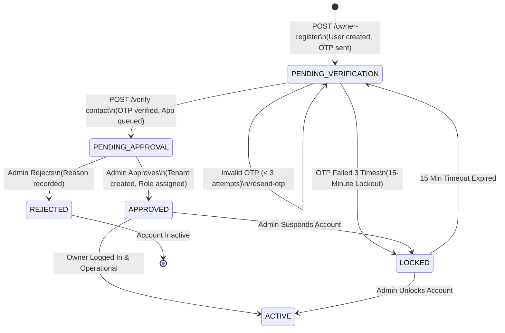
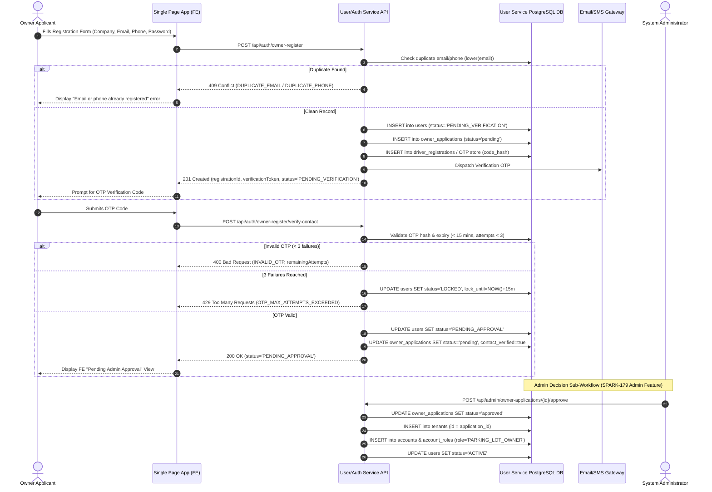

# SmartPark - Owner Register API Design Specification

**Issue ID:** SPARK-175 (Design) / SPARK-179 (BE Implementation) / SPARK-180 (FE) / SPARK-181 (Verification)  
**Sprint:** Sprint 2  
**Estimate:** 1 SP  
**Author:** Team Lead / Architecture Lead  
**Status:** Approved Specification Baseline  
**Date:** 2026-10-08  
**Target Release:** SmartPark v0.9 Baseline  

---

## 1. Overview & Business Objectives

### 1.1 Objective
This document defines the normative API design contract for **Owner Registration** (`POST /api/auth/owner-register` and associated verification/status endpoints) for SmartPark Sprint 2. It bridges requirement specifications (SRS §3.1.1, §3.1.4, §2.3.1; FR-AUTH-01/05/06; UC-AUTH-01/02; BR-AUTH-01/02/03; BR-PRIV-03) with relational persistence models (`User Service DB` schema integration baseline `69d4da2` / `01-user-service-alignment.sql`).

### 1.2 Core Scope & Business Rules
1. **Required Contact & Enterprise Fields:** Collects `companyName` (Enterprise name), `email` (Primary contact), `phone` (Phone number), and `password`.
2. **Public Email Domain Approval:** Non-corporate email domains (e.g., `@gmail.com`, `@yahoo.com`, `@outlook.com`) are explicitly permitted per BA decisions dated 2026-10-06.
3. **No Identity Document Over-collection:** CCCD (Citizen ID) / GPLX (Driver License) fields are **strictly excluded** from Owner registration.
4. **Strict Server Authority:** Clients cannot specify `role`, `permissions`, `approvalStatus`, `accountStatus`, or `tenantId`. Any client-supplied privileges are discarded or rejected with `400 Bad Request`.
5. **Two-Gate Security Separation:**
   - **Gate 1 (Contact Verification):** Proves ownership of email/phone via verification code (OTP). Successful verification transitions account state from `PENDING_VERIFICATION` to `PENDING_APPROVAL`.
   - **Gate 2 (Admin Approval):** Administrative review required before granting operational privileges.
6. **Strict Access Guard:** Authenticated tokens issued to accounts in `PENDING_VERIFICATION`, `PENDING_APPROVAL`, or `REJECTED` states **cannot** execute any Owner operational endpoints (e.g., parking lot management, slot creation, operator assignment). They receive `403 Forbidden` with an explicit `ACCOUNT_PENDING_APPROVAL` machine-readable code.
7. **Admin Decision Separation:** The Admin decision endpoints (`POST /api/admin/owner-applications/{id}/approve` and `/reject`) are decoupled into the Admin Approval feature domain ([SPARK-179](https://mangamanagement.atlassian.net/browse/SPARK-179)).

---

## 2. Endpoint & Permission Matrix

| Endpoint | Method | Auth Required | Allowed Roles / States | Description |
| :--- | :---: | :---: | :--- | :--- |
| `/api/auth/owner-register` | `POST` | Anonymous | `Public` | Submits initial Owner registration & company info; initiates contact verification. |
| `/api/auth/owner-register/verify-contact` | `POST` | Anonymous / Token | `PENDING_VERIFICATION` | Validates contact OTP/token; transitions user to `PENDING_APPROVAL` and queues `owner_applications`. |
| `/api/auth/owner-register/status` | `GET` | Bearer Token | `PENDING_VERIFICATION`, `PENDING_APPROVAL`, `APPROVED`, `REJECTED` | Checks registration status and retrieves status-specific metadata for the FE pending-approval view. |
| `/api/auth/owner-register/resend-otp` | `POST` | Anonymous / Token | `PENDING_VERIFICATION` | Resends contact verification code subject to rate limiting and 15-minute lock constraints. |

---

## 3. State & Sequence Models

### 3.1 Owner Account & Application Lifecycle State Diagram



### 3.2 Registration & Verification Sequence Diagram



---

## 4. Requirement ↔ Data Schema ↔ DTO Mapping

| Requirement Identifier | API DTO Field Name (camelCase) | Data Type & Nullability | Validation & Business Constraints | DB Table & Column (snake_case) | DB Column Type |
| :--- | :--- | :--- | :--- | :--- | :--- |
| **FR-AUTH-01** | `companyName` | `string` (Required) | Length: 2–100 chars. Trimmed. | `owner_applications.company_name` | `VARCHAR(255) NOT NULL` |
| **FR-AUTH-01** | `email` | `string` (Required) | RFC 5322 Email. Lowercase normalized. Public domains allowed. | `users.email` | `VARCHAR(255) UNIQUE` |
| **FR-AUTH-01** | `phone` | `string` (Required) | E.164 format or 10-11 digit local (e.g., `+84901234567` / `0901234567`). | `users.phone` | `VARCHAR(20) NULLABLE` |
| **FR-AUTH-01** | `password` | `string` (Required) | Min 8 chars, 1 uppercase, 1 lowercase, 1 digit, 1 special char. | `users.password_hash` | `TEXT NOT NULL` |
| **BR-AUTH-01** | `registrationId` | `UUID` (System Generated) | Primary key for application tracking. | `owner_applications.id` | `UUID PK` |
| **BR-AUTH-02** | `status` | `enum` (Read-only System State) | Enum: `PENDING_VERIFICATION`, `PENDING_APPROVAL`, `APPROVED`, `REJECTED`, `LOCKED`. | `users.status` | `VARCHAR NOT NULL` |
| **BR-AUTH-03** | `verificationCode` | `string` (Request input) | Exactly 6 numeric digits (`^[0-9]{6}$`). | `driver_registrations.code_hash` | `TEXT NOT NULL` |
| **SPARK-176** | `applicationStatus` | `enum` (Read-only System State) | Enum: `pending`, `approved`, `rejected`. | `owner_applications.status` | `VARCHAR NOT NULL` |
| **SPARK-1** | `userId` | `UUID` (System Generated) | Foreign Key linking application to User identity. | `owner_applications.user_id` | `UUID UNIQUE FK` |

---

## 5. API Endpoint Technical Specifications

### 5.1 Registration Request (`POST /api/auth/owner-register`)

#### Request Headers
```http
Content-Type: application/json
X-Client-Version: 1.0.0
```

#### Request Body Schema
```json
{
  "$schema": "http://json-schema.org/draft-07/schema#",
  "type": "object",
  "required": ["companyName", "email", "phone", "password"],
  "additionalProperties": false,
  "properties": {
    "companyName": {
      "type": "string",
      "minLength": 2,
      "maxLength": 100,
      "example": "Saigon Central Parking Co., Ltd"
    },
    "email": {
      "type": "string",
      "format": "email",
      "maxLength": 255,
      "example": "owner.contact@gmail.com"
    },
    "phone": {
      "type": "string",
      "pattern": "^(\\+?84|0)[3|5|7|8|9][0-9]{8}$",
      "example": "0901234567"
    },
    "password": {
      "type": "string",
      "minLength": 8,
      "maxLength": 64,
      "example": "P@ssword2026!"
    }
  }
}
```

#### Sample Success Response (`201 Created`)
```json
{
  "success": true,
  "code": "OWNER_REGISTRATION_SUBMITTED",
  "message": "Owner registration request received. Please check your contact for verification OTP.",
  "data": {
    "registrationId": "a1b2c3d4-e5f6-7890-abcd-1234567890ab",
    "userId": "98765432-10ab-cdef-0123-456789abcdef",
    "email": "owner.contact@gmail.com",
    "phone": "0901234567",
    "companyName": "Saigon Central Parking Co., Ltd",
    "status": "PENDING_VERIFICATION",
    "otpExpiresAt": "2026-10-08T10:12:42Z",
    "createdAt": "2026-10-08T09:57:42Z"
  }
}
```

---

### 5.2 Contact Verification (`POST /api/auth/owner-register/verify-contact`)

#### Request Body Schema
```json
{
  "registrationId": "a1b2c3d4-e5f6-7890-abcd-1234567890ab",
  "verificationCode": "482910"
}
```

#### Sample Success Response (`200 OK`)
```json
{
  "success": true,
  "code": "CONTACT_VERIFIED_PENDING_APPROVAL",
  "message": "Contact verified successfully. Registration application is pending Admin approval.",
  "data": {
    "registrationId": "a1b2c3d4-e5f6-7890-abcd-1234567890ab",
    "userId": "98765432-10ab-cdef-0123-456789abcdef",
    "status": "PENDING_APPROVAL",
    "applicationStatus": "pending",
    "verifiedAt": "2026-10-08T10:01:15Z"
  }
}
```

---

### 5.3 Registration Status Lookup (`GET /api/auth/owner-register/status`)

#### Request Headers
```http
Authorization: Bearer <access_token>
```

#### Sample Response (`200 OK` - Pending Approval State)
```json
{
  "success": true,
  "code": "REGISTRATION_STATUS_RETRIEVED",
  "data": {
    "registrationId": "a1b2c3d4-e5f6-7890-abcd-1234567890ab",
    "companyName": "Saigon Central Parking Co., Ltd",
    "email": "owner.contact@gmail.com",
    "status": "PENDING_APPROVAL",
    "applicationStatus": "pending",
    "submittedAt": "2026-10-08T09:57:42Z",
    "estimatedReviewTime": "24-48 Hours",
    "feViewConfig": {
      "viewMode": "PENDING_APPROVAL_BANNER",
      "canAccessDashboard": false,
      "message": "Your registration is under review by SmartPark Admin. Operational features are disabled until approval."
    }
  }
}
```

---

## 6. Error Catalogue & Machine-Readable Responses

All API errors follow the standard SmartPark machine-readable RFC 7807 error format:

```json
{
  "type": "https://api.smartpark.com/errors/DUPLICATE_EMAIL",
  "title": "Conflict",
  "status": 409,
  "code": "DUPLICATE_EMAIL",
  "detail": "The email address 'owner.contact@gmail.com' is already registered in the system.",
  "instance": "/api/auth/owner-register",
  "timestamp": "2026-10-08T09:57:42Z",
  "invalidParams": [
    {
      "name": "email",
      "reason": "Email address must be unique across all user accounts."
    }
  ]
}
```

### Error Code Inventory Table

| HTTP Status | Error Code | Description / Root Cause | Actionable FE Guidance |
| :---: | :--- | :--- | :--- |
| `400` | `INVALID_PAYLOAD` | Missing required fields (`companyName`, `email`, etc.). | Highlight missing input fields in form. |
| `400` | `INVALID_CONTACT_FORMAT` | Phone number or Email fails format regex validation. | Show inline format error under input box. |
| `400` | `INVALID_OTP` | Submitted verification code does not match stored hash. | Show "Invalid code. Please re-enter." |
| `400` | `OTP_EXPIRED` | OTP submitted after 15-minute validity window. | Prompt user to click "Resend Code". |
| `403` | `ACCOUNT_PENDING_APPROVAL` | Unapproved Owner attempting to access restricted Owner API. | Redirect user to Pending Approval View. |
| `403` | `ACCOUNT_REJECTED` | Owner whose application was rejected attempting operation. | Display rejection notification & reason. |
| `409` | `DUPLICATE_EMAIL` | Case-insensitive match found on `lower(email)`. | Prompt user to log in or use different email. |
| `409` | `DUPLICATE_PHONE` | Exact match found on normalized `phone`. | Prompt user to verify phone number. |
| `429` | `OTP_MAX_ATTEMPTS_EXCEEDED` | 3 consecutive failed OTP attempts triggered 15-min lockout. | Disable OTP submit button for 15 minutes. |
| `429` | `RATE_LIMIT_EXCEEDED` | Excessive registration attempts from single IP (>5/min). | Temporarily throttle client requests. |

---

## 7. Edge Case Inventory & Technical Controls

### 7.1 Duplicate & Concurrent Submissions
- **Database Safeguard:** Enforced via PostgreSQL `UNIQUE INDEX` on `users(lower(email))` and `users(phone)`.
- **Race Condition Prevention:** Concurrency handled at DB level; database returns violation code `23505` (`unique_violation`), mapped by API gateway/service to `409 Conflict` with `DUPLICATE_EMAIL` or `DUPLICATE_PHONE`.

### 7.2 OTP Lockout & Replay Defense
- **Attempt Limit:** 3 incorrect OTP entries cause immediate account transition to `LOCKED` status for 15 minutes (`lock_until = NOW() + INTERVAL '15 minutes'`).
- **Replay Protection:** Once verified, `code_hash` is invalidated (`consumed = true`), preventing OTP code reuse.

### 7.3 Privilege Escalation Invalidation
- If client sends fields such as `{"role": "ADMIN", "status": "APPROVED", "permissions": ["*"]}`, the API DTO binder uses strict whitelist deserialization (`additionalProperties: false`), ignoring or rejecting unauthorized payload attributes.

### 7.4 Security Guard Middleware
- Middleware inspects JWT claims on protected routes (`/api/owner/*`).
- If `user.status != 'ACTIVE'` or `user.account_role != 'PARKING_LOT_OWNER'`, request is aborted with `403 Forbidden` (`ACCOUNT_PENDING_APPROVAL`).

---

## 8. Unresolved Decision & Conflict Log

| Issue Key | Topic | Description & Decision Context | Status |
| :--- | :--- | :--- | :--- |
| **DEC-AUTH-01** | Email Domain Policy | **Confirmed (2026-10-06):** Public email domains (`@gmail.com`, etc.) are permitted for Owner registration to lower onboarding friction. | **Resolved** |
| **DEC-AUTH-02** | Contact Verification Channel | **Default Baseline:** Email OTP is default for Sprint 2 MVP. SMS fallback support prepared via configuration key. | **Resolved** |
| **DEC-AUTH-03** | Auto-Tenant Creation Boundary | **Confirmed Architecture:** Tenant creation (`tenants.id = application_id`) occurs strictly during **Admin Approval** phase ([SPARK-179](https://mangamanagement.atlassian.net/browse/SPARK-179)), NOT during registration submission. | **Resolved** |
| **DEC-AUTH-04** | Document Collection Scope | **Confirmed SRS §3.1.1:** Business license or CCCD uploads are deferred to future enterprise onboarding modules. | **Resolved** |

---

## 9. Verification & Acceptance Checklist

- [x] OpenAPI 3.0 / Versioned REST API Specification documented.
- [x] Endpoint Permission Matrix defined for all roles and account states.
- [x] Mermaid State Diagram (`PENDING_VERIFICATION` -> `PENDING_APPROVAL` -> `APPROVED` / `REJECTED`) and Sequence Diagram embedded.
- [x] Traceability Table mapping SRS ↔ DB Schema (`users`, `owner_applications`) ↔ DTO fields.
- [x] Sample payloads for Request, Success Response, and RFC 7807 Machine-Readable Errors included.
- [x] Edge-case inventory (concurrency, rate-limiting, privilege injection, OTP lockout) fully specified.
