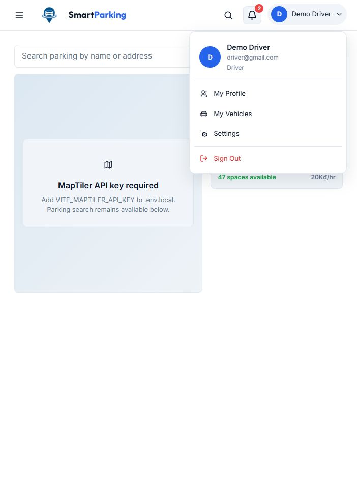

# Chạy và kiểm tra login/logout đã nối frontend

Ngày cập nhật: **05/10/2026**. Repository: `Mock-Project-Smart-Parking`, branch `demo`.

## Chạy local

Tại thư mục gốc demo, mở hai terminal:

```powershell
dotnet run --project src/Services/UserService/SmartParking.UserService.API --launch-profile http
```

```powershell
Set-Location FE
npm.cmd run dev -- --host 127.0.0.1
```

Mở [frontend](http://127.0.0.1:5173/). API mặc định tại `http://localhost:5035`; `FE/src/lib/authApi.ts` hỗ trợ `VITE_API_BASE_URL` khi cần đổi API. CORS demo chỉ cho localhost/127.0.0.1 port 5173; nếu Vite tự chọn port khác, giải phóng port hoặc bổ sung origin có chủ đích.

Account fixture: **driver@gmail.com / Password@123**. Đây là thông tin seed công khai phục vụ demo, không phải credential vận hành. Các account trong localStorage/frontend Sign Up chưa đồng bộ backend và không đăng nhập qua API được.

## Kịch bản trình diễn

1. Sign In, nhập account fixture với password sai: thấy `Invalid email or password.`.
2. Nhập password đúng: dashboard hiển thị **Demo Driver**.
3. F5: account được khôi phục bằng `GET /api/auth/me`.
4. Mở menu account → Sign Out: quay về trang public.
5. F5: không trở lại dashboard.
6. Chạy collection Postman: token sau logout phải bị 401.
7. Login rồi tắt API và Sign Out: giao diện hiện lỗi kết nối; khởi động API lại và thử Sign Out lần nữa. Phiên cũ đã mất khi API restart.
8. Phiên demo hết sau 5 phút; frontend quay về Sign In, backend từ chối expired token.

Không lưu hoặc chụp token/password thật để làm report. Dữ liệu parking/wallet/booking vẫn là mock; map thiếu API key không ảnh hưởng login.

## Hợp đồng API hiện tại

| Endpoint | Request | Thành công | Lỗi |
| --- | --- | --- | --- |
| POST /api/auth/login | JSON email/password | 200: success, data.accessToken, expiresIn=300, tokenType=Bearer, refreshToken=null, user (userId/fullName/email/role) | 400 validation; 401 credential/account không hợp lệ |
| GET /api/auth/me | Authorization: Bearer token | 200: success, data=user | 401 thiếu/giả/hết hạn/thu hồi token hoặc account không Active |
| POST /api/auth/logout | Authorization: Bearer token | 204, không có JSON body | 401 phiên không hợp lệ; frontend coi phiên 401 đã không dùng được và xóa local state |

Logout thu hồi **phiên hiện tại**. Nó không phải logout mọi thiết bị. Session store chỉ in-memory; reset/restart API làm các phiên cũ mất hiệu lực.

Frontend dùng sessionStorage của tab để giữ access token qua F5, không lưu password từ login. User/role localStorage không được dùng để khôi phục xác thực. Không có refresh endpoint; sau hết hạn phải login lại.

## Kiểm tra có thể chạy lại

```powershell
dotnet test SmartParking.slnx
dotnet build src/Services/UserService/SmartParking.UserService.API/SmartParking.UserService.API.csproj
Set-Location FE
npm.cmd run build
.\node_modules\.bin\tsc.cmd --noEmit
```

Khi API đang chạy, import `docs/04-testing/postman/UserService.postman_collection.json` rồi chạy Collection Runner theo thứ tự. Collection giữ token trong biến tạm ở runtime và xóa biến sau kiểm tra revoked token.

Nếu đã có Newman trong cache dự án:

```powershell
node .cache/npm/_npx/75b90f33e80c3d7c/node_modules/newman/bin/newman.js run docs/04-testing/postman/UserService.postman_collection.json
```

Không dựa vào đường dẫn cache này trên máy khác; có thể dùng Postman Runner thay thế.

Kết quả 05/10/2026: backend 16/16 test đạt (15 ca auth mới, 1 scaffold có sẵn), API build thành công; frontend build và TypeScript đạt; browser đã kiểm tra login sai/đúng, F5, logout và lỗi mạng. Newman: **10/10 request, 23/23 assertion đạt**, gồm me, logout và dùng lại token đã thu hồi.

Ảnh minh chứng account trả từ backend và menu Sign Out:



## Giới hạn nghiệm thu

Đây là **tích hợp login/logout của demo hiện tại**, chưa phải bản auth đạt toàn bộ SRS. Còn thiếu OTP/lockout/MFA, bcrypt, RS256, session 24 giờ + refresh 7 ngày/rotation, đăng ký backend, store dùng chung và phân quyền nghiệp vụ. Xem [report quyết định](../05-project-management/decision-log/auth-demo-vs-van-report-2026-10-05.md).
